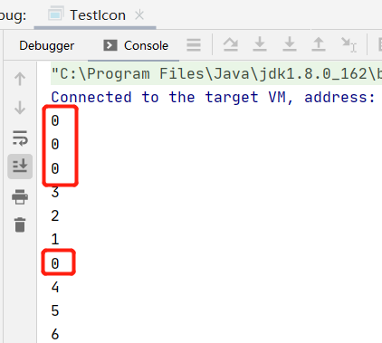

#[前言](https://www.jianshu.com/p/1f19835e05c0)
在Java中，线程部分是一个重点，本篇文章说的JUC也是关于线程的。JUC就是java.util .concurrent工具包的简称。
这是一个处理线程的工具包，JDK 1.5开始出现的。下面一起来看看它怎么使用。


# 一、volatile关键字与内存可见性
## 1、内存可见性：
```java
public class TestVolatile {
    public static void main(String[] args){ //这个线程是用来读取flag的值的
        ThreadDemo threadDemo = new ThreadDemo();
        Thread thread = new Thread(threadDemo);
        thread.start();
        while (true){
            if (threadDemo.isFlag()){
                System.out.println("主线程读取到的flag = " + threadDemo.isFlag());
                break;
            }
        }
    }
}

@Data
class ThreadDemo implements Runnable{ //这个线程是用来修改flag的值的
    public  boolean flag = false;
    @Override
    public void run() {
        try {
            Thread.sleep(200);
        } catch (InterruptedException e) {
            e.printStackTrace();
        }
        flag = true;
        System.out.println("ThreadDemo线程修改后的flag = " + isFlag());
    }
}
```
这段代码很简单，就是一个ThreadDemo类继承Runnable创建一个线程。它有一个成员变量flag为false，然后重写run方法，
在run方法里面将flag改为true，同时还有一条输出语句。然后就是main方法主线程去读取flag。如果flag为true，就会break掉while循环，
否则就是死循环。按道理，下面那个线程将flag改为true了，主线程读取到的应该也是true，循环应该会结束。看看运行结果：


从图中可以看到，该程序并没有结束，也就是死循环。说明主线程读取到的flag还是false，可是另一个线程明明将flag改为true了，
而且打印出来了，这是什么原因呢？这就是内存可见性问题。

- 内存可见性问题：当多个线程操作共享数据时，彼此不可见。

看下图理解上述代码：


要解决这个问题，可以加锁。如下：

```
while (true){
        synchronized (threadDemo){
            if (threadDemo.isFlag()){
                System.out.println("主线程读取到的flag = " + threadDemo.isFlag());
                break;
            }
        }
 }
```
加了锁，就可以让while循环每次都从主存中去读取数据，这样就能读取到true了。但是一加锁，每次只能有一个线程访问，当一个线程持有锁时，其他的就会阻塞，
效率就非常低了。不想加锁，又要解决内存可见性问题，那么就可以使用volatile关键字。

## 2、volatile关键字
用法：

volatile关键字：当多个线程操作共享数据时，可以保证内存中的数据可见。用这个关键字修饰共享数据，就会及时的把线程缓存中的数据刷新到主存中去，
也可以理解为，就是直接操作主存中的数据。所以在不使用锁的情况下，可以使用volatile。如下：
```java
public  volatile boolean flag = false;
```

这样就可以解决内存可见性问题了。

volatile和synchronized的区别：
- volatile不具备互斥性(当一个线程持有锁时，其他线程进不来，这就是互斥性)。
- volatile不具备原子性。

# 二、原子性

## 1、理解原子性

上面说到volatile不具备原子性，那么原子性到底是什么呢？先看如下代码：

```java
public class TestIcon {
    public static void main(String[] args){
        AtomicDemo atomicDemo = new AtomicDemo();
        for (int x = 0;x < 10; x++){
            new Thread(atomicDemo).start();
        }
    }
}

class AtomicDemo implements Runnable{
    private int i = 0;
    public int getI(){
        return i++;
    }
    @Override
    public void run() {
        try {
            Thread.sleep(200);
        } catch (InterruptedException e) {
            e.printStackTrace();
        }
        System.out.println(getI());
    }
}
```
这段代码就是在run方法里面让i++，然后启动十个线程去访问。看看结果：



可以发现，出现了重复数据。明显产生了多线程安全问题，或者说原子性问题。所谓原子性就是操作不可再细分，而i++操作分为读改写三步，如下

```java
    int temp = i;
    i = i+1;
    i = temp;
```
所以i++明显不是原子操作。上面10个线程进行i++时，内存图解如下：


看到这里，好像和上面的内存可见性问题一样。是不是加个volatile关键字就可以了呢？其实不是的，因为加了volatile，
只是相当于所有线程都是在主存中操作数据而已，但是不具备互斥性。比如两个线程同时读取主存中的0，然后又同时自增，同时写入主存，结果还是会出现重复数据。

## 2、原子变量

JDK 1.5之后，Java提供了原子变量，在java.util.concurrent.atomic包下。原子变量具备如下特点：

- 有volatile保证内存可见性。
- 用CAS算法保证原子性。

3、CAS算法：
CAS算法是计算机硬件对并发操作共享数据的支持，CAS包含3个操作数：

- 内存值V
- 预估值A
- 更新值B

当且仅当V==A时，才会把B的值赋给V，即V = B，否则不做任何操作。就上面的i++问题，CAS算法是这样处理的：首先V是主存中的值0，然后预估值A也是0，因为此时还没有任何操作，这时V=B，所以进行自增，同时把主存中的值变为1。如果第二个线程读取到主存中的还是0也没关系，因为此时预估值已经变成1，V不等于A，所以不进行任何操作。

4、使用原子变量改进i++问题：
原子变量用法和包装类差不多，如下：
```java
 //private int i = 0;
 AtomicInteger i = new AtomicInteger();
 public int getI(){
     return i.getAndIncrement();
 }
```
只改这两处即可。
