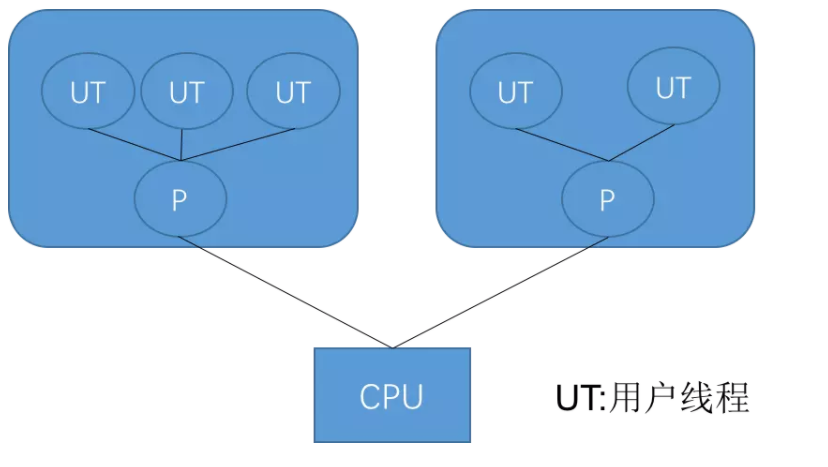

# [前言](https://blog.csdn.net/qq_41701956/article/details/81664921)

本文是学习了《深入理解Java虚拟机》之后的总结，主要内容都来自于书中，也有作者的一些理解。一是为了梳理知识点，归纳总结，二是为了分享交流，如有错误之处还望指出。
用XMind画了一张导图（源文件对部分节点有详细备注和参考资料，需要的朋友可以关注我的微信公众号：Java团长，然后回复“JVM”获取）：

.png)

JVM是Java Virtual Machine的简称。意为Java虚拟机
虚拟机:
指通过软件模拟的具有完整硬件系统功能的、运行在一个完全隔离环境中的完整计算机系统

有哪些虚拟机:

VMWare,
Visual Box,
JVM,

VMWare或者Visual Box都是使用软件模拟物理CPU的指令集

JVM使用软件模拟Java 字节码的指令集

规范
Java语言规范定义了什么是Java语言,JVM规范定义了什么是java虚拟机,二进制class文件和JVM指令集等,比如class文件的文件结构,jvm能够执行的指令集等

Java语言规范

Java内存模型

类加载链接的过程

public static final abstract的定义

异常

数组的使用

…….

JVM规范

Class 文件格式

数字的内部表示和存储

Byte  -128 to 127 (-27 to 27 - 1)

returnAddress 数据类型定义

指向操作码的指针。不对应Java数据类型，不能在运行时修改。Finally实现需要

定义PC,堆,栈,方法区
# 1.Java 内存区域与内存溢出异常
JVM的体系结构

- 1 类装载器（ClassLoader）（用来装载.class文件）
- 2 执行引擎（执行字节码，或者执行本地方法）
- 3 运行时数据区（方法区、堆、java栈、PC寄存器、本地方法栈）

对于Java程序员来说，在虚拟机自动内存管理机制的帮助下，不再需要为每一个new操作去写对应的delete/free代码，不容易出现内存泄漏和内存溢出问题，由虚拟机管理内存。不过，也正是Java程序员把内存控制的权力交给了Java虚拟机，一旦出现内存泄漏和溢出方面的问题，如果不了解Java虚拟机是如何使用内存的，那么排查错误将会成为一项异常艰难的工作。 
Java虚拟机在执行Java程序的过程中会将其管理的内存划分为若干个不同的数据区域，这些区域有各自的用途，及创建和销毁的时间，有些区域随虚拟机进程的启动而存在，有些区域则是依赖用户线程的启动和结束来建立和销毁。Java虚拟机所管理的内存包括以下几个运行时数据区域，如图（图片引自网络）：

内存模型图一


图二


图二


## 1.1 运行时数据区域
根据《Java 虚拟机规范(Java SE 7 版)》规定，Java 虚拟机所管理的内存如下图所示。


### 1.1.1	程序计数器（Program Counter Register）
**解释1:**

程序计数器是一块较小的内存空间，线程私有。它的作用可以看做是当前线程所执行的字节码的信号指示器。字节码解释器就是通过改变该计数器的值来选取下一条需要执行的字节码指令，分支、循环、跳转、异常处理、线程恢复等基础功能都需依赖计数器来完成。
每一个JVM线程都有独立的程序计数器，各线程间的计数器互不影响，独立存储，确保线程切换后能够恢复到正确的执行位置。
在任意时刻，一条JVM线程只会执行一个方法的代码。该方法称为该线程的当前方法（Current Method），如果该方法是Java方法，那计数器保存JVM正在执行的字节码指令的地址；如果该方法是Native，那PC寄存器的值为空（Undefined）。
此内存区域是唯一一个在Java虚拟机规范中没有规定任何OutOfMemoryError情况的区域。

**解释2:**

内存空间小，线程私有。字节码解释器工作是就是通过改变这个计数器的值来选取下一条需要执行指令的字节码指令，分支、循环、跳转、异常处理、线程恢复等基础功能都需要依赖计数器完成
如果线程正在执行一个 Java 方法，这个计数器记录的是正在执行的虚拟机字节码指令的地址；如果正在执行的是 Native 方法，这个计数器的值则为 (Undefined)。此内存区域是唯一一个在 Java 虚拟机规范中没有规定任何 OutOfMemoryError 情况的区域。
### 1.1.2 Java虚拟机栈（Java Virtual Machine Stack）
JVM栈是线程私有的，每个线程创建的同时都会创建JVM栈，JVM栈中存放的为当前线程中局部基本类型的变量（java中定义的八种基本类型：boolean、char、byte、short、int、long、float、double）、部分的返回结果以及Stack Frame，非基本类型的对象在JVM栈上仅存放一个指向堆上的地址,栈由一系列帧组成（因此Java栈也叫做帧栈）
帧保存一个方法的局部变量、操作数栈、常量池指针, 局部变量表 包含参数和局部变量
每一次方法调用创建一个帧，并压栈递归,每次方法的调用创建一个帧

**解释1:**

Java虚拟机栈与程序计数器一样，也是线程私有的，其生命周期与线程相同。虚拟机栈描述的是Java方法执行的内存模型：每个方法被执行的时候都会同时创建一个栈帧（Stack Frame）用于存储局部变量表、操作数栈、动态链接、方法出口等信息。每一个方法被调用直至执行完成的过程就对应着一个栈帧在虚拟机栈中从入栈到出栈的过程。
局部变量表存放了编译期可知的各种基本数据类型（boolean、byte、char、short、int、float、long、double）、对象引用（reference类型）和returnAddress类型（指向了一条字节码指令的地址）。其中64位长度的long和double会占用2个局部变量空间（Slot），其余数据类型只占用1个。局部变量表所需的空间在编译期间完成分配，当进入一个方法时，其需要在帧中分配多大的局部变量空间是确定的，方法运行期间不会改变局部变量表的大小。
Java虚拟机规范中对该区域规定了两种异常情况：
1）如线程请求的深度大于虚拟机所允许的深度，抛出StackOverflowError异常。
2）虚拟机栈动态扩展无法申请到足够的内存时，抛出OutOfMemoryError异常。

**解释2:**
线程私有，生命周期和线程一致。描述的是 Java 方法执行的内存模型：每个方法在执行时都会床创建一个栈帧(Stack Frame)用于存储局部变量表、操作数栈、动态链接、方法出口等信息。每一个方法从调用直至执行结束，就对应着一个栈帧从虚拟机栈中入栈到出栈的过程。
局部变量表：存放了编译期可知的各种基本类型(boolean、byte、char、short、int、float、long、double)、对象引用(reference 类型)和 returnAddress 类型(指向了一条字节码指令的地址)
StackOverflowError：线程请求的栈深度大于虚拟机所允许的深度。
OutOfMemoryError：如果虚拟机栈可以动态扩展，而扩展时无法申请到足够的内存。


**栈、堆、方法区交互**

栈(先进后出)
Java当中没有寄存器的,所以参数传递使用操作数栈

```java
public class AppMain {
    //运行时, jvm 把appmain的信息都放入方法区
    public static void main(String[] args) {
        //main 方法本身放入方法区。
        Sample test1 = new Sample(" 测试1 ");
        //test1是引用，所以放到栈区里， Sample是自定义对象应该放到堆里面
        Sample test2 = new Sample(" 测试2 ");

        test1.printName();
        test2.printName();
    }
}

class Sample {
    //运行时, jvm 把appmain的信息都放入方法区
    private String name;
    //new Sample实例后， name 引用放入栈区里，  name 对象放入堆里

    public Sample(String name) {
        this.name = name;
    }

    //print方法本身放入 方法区里。
    public void printName() {
        System.out.println(name);
    }
}

```
**可见性**

一个线程修改了变量，其他线程可以立即知道
保证可见性的方法volatile
synchronized （unlock之前，写变量值回主存）
final(一旦初始化完成，其他线程就可见)

**VM指令集**

类型转化 ：比如长整型转成整型
出栈入栈操作:操作值
运算:加减乘除
流程控制:相等不相等,跳转
函数调用:接口调用等

### 1.1.3	本地方法栈（Native Method Stack）
**解释1:**

JVM采用本地方法堆栈来支持native方法的执行，此区域用于存储每个native方法调用的状态。

Java虚拟机可能会使用到传统的栈来支持native方法（使用Java语言以外的其它语言编写的方法）的执行，这个栈就是本地方法栈（Native Method Stack）。本地方法栈与虚拟机栈非常类似，区别是虚拟机栈为虚拟机执行Java方法（也就是字节码）服务，而本地方法栈则为虚拟机使用到的Native方法服务。虚拟机规范对本地方法栈中的方法是用语言、使用方式与数据结构没强制规定，因此虚拟机可以自由实现，如Sun HotSpot虚拟机直接把本地方法栈和虚拟机栈合二为一。       Java虚拟机规范中对该区域规定了两种异常情况：
1）如线程请求的深度大于虚拟机所允许的深度，抛出StackOverflowError异常。
2）虚拟机栈动态扩展无法申请到足够的内存时，抛出OutOfMemoryError异常。

**解释2:**

区别于 Java 虚拟机栈的是，Java 虚拟机栈为虚拟机执行 Java 方法(也就是字节码)服务，而本地方法栈则为虚拟机使用到的 Native 方法服务。也会有 StackOverflowError 和 OutOfMemoryError 异常。

### 1.1.4	Java堆（Java Heap）
**解释1:**

和程序开发密切相关,应用系统对象都保存在Java堆中,所有线程共享Java堆
对分代GC来说，堆也是分代的
GC的主要工作区间
它是JVM用来存储对象实例以及数组值的区域，可以认为Java中所有通过new创建的对象的内存都在此分配，Heap中的对象的内存需要等待GC进行回收。
（1）       堆是JVM中所有线程共享的，因此在其上进行对象内存的分配均需要进行加锁，这也导致了new对象的开销是比较大的
（2）       Sun Hotspot JVM为了提升对象内存分配的效率，对于所创建的线程都会分配一块独立的空间TLAB（Thread Local Allocation Buffer），其大小由JVM根据运行的情况计算而得，在TLAB上分配对象时不需要加锁，因此JVM在给线程的对象分配内存时会尽量的在TLAB上分配，在这种情况下JVM中分配对象内存的性能和C基本是一样高效的，但如果对象过大的话则仍然是直接使用堆空间分配
（3）       TLAB仅作用于新生代的Eden Space，因此在编写Java程序时，通常多个小的对象比大的对象分配起来更加高效。

Java堆是Java虚拟机管理内存中最大的一块，是所有线程共享的内存区域，随虚拟机的启动而创建。该区域唯一目的是存放对象实例，几乎所有对象的实例都在堆里面分配。Java堆是垃圾收集器管理的主要区域，被称作“GC堆”。
Java虚拟机规范规定，Java堆可以出于物理上不连续的内存空间中，只要逻辑上连续即可，如同磁盘空间一样，既可以实现成固定大小，也可以是扩展的，当前主流虚拟机都是按照扩展来实现的（通过-Xmx和-Xms控制）。
Java虚拟机规范中对该区域规定了OutOfMemoryError异常：如果堆中没有内存完成实例分配，并且堆无法再扩展则抛出OutOfMemoryError异常。

**解释2:**

对于绝大多数应用来说，这块区域是 JVM 所管理的内存中最大的一块。线程共享，主要是存放对象实例和数组。内部会划分出多个线程私有的分配缓冲区(Thread Local Allocation Buffer, TLAB)。可以位于物理上不连续的空间，但是逻辑上要连续。
OutOfMemoryError：如果堆中没有内存完成实例分配，并且堆也无法再扩展时，抛出该异常。
### 1.1.5	方法区（Method Area）

**解释1:**

保存装载的类信息,类的原信息,对类进行描述,类型的常量池,字段，方法信息,方法字节码
通常和永久区(Perm)关联在一起
（1）在Sun JDK中这块区域对应的为PermanetGeneration，又称为永久代。
（2）方法区域存放了所加载的类的信息（名称、修饰符等）、类中的静态变量、类中定义为final类型的常量、类中的Field信息、类中的方法信息，当开发人员在程序中通过Class
对象中的getName、isInterface等方法来获取信息时，这些数据都来源于方法区域，同时方法区域也是全局共享的，在一定的条件下它也会被GC，当方法区域需要使用的内存超过其允许的大小时，会抛出OutOfMemory的错误信息。

方法区与Java堆一样，是各个线程共享的内存区域，用于存储一杯虚拟机加载的类信息、常量、静态变量、即时编译器编译后的代码等数据。Java虚拟机对这个区域的限制非常宽松，处理和Java对一样不需要连续的内存和可以选择固定大小或者可扩展外，还可以选择不实现垃圾收集。
Java虚拟机规范中对该区域规定了OutOfMemoryError异常： 如果方法区的内存空间不能满足内存分配请求，那Java虚拟机将抛出一个OutOfMemoryError异常。
其中对于方法区，很多人更愿意称为：“永久代（Permanent Generation）”，不过本质上两者并不等价，仅仅是因为习惯使用HotSpot虚拟机的设计团队选择吧GC分代收集扩展至方法区，或者说使用永久代来实现方法区而已，这样HotSpot的垃圾收集器就可以像管理Java堆一样管理这部分内存，能够省去专门为方法区变编写内存管理代码的工作。不过对于其他虚拟机（如BEA JRockit、IBM J9等）来说并不存在永久代的概念
jdk1.8之前的内存模型，其中方法区和堆是是线程共享的，但是在jdk1.8之后
元数据区取代了永久代。元空间的本质和永久代类似，都是对JVM规范中方法区的实现。不过元空间与永久代之间最大的区别在于：元数据空间并不在虚拟机中，而是使用本地内存
注意：Metaspace所占用的内存空间不是在虚拟机内部，而是在本地内存空间中，这也是与1.7的永久代最大的区别所在。


**解释2:**

属于共享内存区域，存储已被虚拟机加载的类信息、常量、静态变量、即时编译器编译后的代码等数据。
现在用一张图来介绍每个区域存储的内容。


### 1.1.6	运行时常量池（Runtime Constant Pool）

**解释1:**

存放的为类中的固定的常量信息、方法和Field的引用信息等，其空间从方法区域中分配。
    运行时常量池是方法区的一部分。Class文件中除了有类的版本、字段、方法、接口等信息外，还有一项信息是常量池，用于存放编译期生成的各种字面常量和符号引用，这部分内容在类加载后存放到方法区的常量池中。
Java虚拟机规范中对该区域规定了OutOfMemoryError异常： 当常量池无法申请到内存时抛出OutOfMemoryError异常。

**解释2:**

属于方法区一部分，用于存放编译期生成的各种字面量和符号引用。编译器和运行期(String 的 intern() )都可以将常量放入池中。内存有限，无法申请时抛出 OutOfMemoryError。

### 1.1.7	直接内存

**解释1:**

直接内存并不是虚拟机运行时数据区域的一部分，也非Java虚拟规范中定义的内存区域，但这部分内存也被频繁使用，并且可能导致OutOfMemoryError异常出现。Java虚拟机需要根据实际内存的大小来设置-Xmx等参数信息，如果忽略了直接内存，使得各个内存区域的总和大于物理内存限制，从而导致动态扩展时抛出OutOfMemoryError异常。

在 JDK 1.4 中新加入 NIO (New Input/Output) 类，引入了一种基于通道(Channel)和缓存(Buffer)的 I/O 方式，它可以使用 Native 函数库直接分配堆外内存，然后通过一个存储在 Java 堆中的 DirectByteBuffer 对象作为这块内存的引用进行操作。可以避免在 Java 堆和 Native 堆中来回的数据耗时操作。

一句代码说明Java栈、Java堆和方法区三个最重要的内存区域之间的关联关系
Object obj = new Object();
假设这句代码出现在方法体中：
1）“Object obj”这部分的语义反映到Java栈的本地变量表中，作为一个reference类型数据出现。
2）“new Object()”这个部分的语义反映到Java堆中，形成一块存储了Object类型所有实例数据值的结构化内存，以及查找到此对象类型的地址信息。
3）Object类的类型数据（如对象类型、父类、接口的实现、方法等）存储在方法区中。

**解释2:**

非虚拟机运行时数据区的部分
在 JDK 1.4 中新加入 NIO (New Input/Output) 类，引入了一种基于通道(Channel)和缓存(Buffer)的 I/O 方式，它可以使用 Native 函数库直接分配堆外内存，然后通过一个存储在 Java 堆中的 DirectByteBuffer 对象作为这块内存的引用进行操作。可以避免在 Java 堆和 Native 堆中来回的数据耗时操作。
OutOfMemoryError：会受到本机内存限制，如果内存区域总和大于物理内存限制从而导致动态扩展时出现该异常。

 **PC寄存器**
PC寄存器是用于存储每个线程下一步将执行的JVM指令，如该方法为native的，则PC寄存器中不存储任何信息。
每个线程拥有一个PC寄存器
在线程创建时 创建
指向下一条指令的地址
执行本地方法时，PC的值为undefined

## 1.2 HotSpot 虚拟机对象探秘
主要介绍数据是如何创建、如何布局以及如何访问的。
### 1.2.1 对象的创建
创建过程比较复杂，建议看书了解，这里提供个人的总结。
遇到 new 指令时，首先检查这个指令的参数是否能在常量池中定位到一个类的符号引用，并且检查这个符号引用代表的类是否已经被加载、解析和初始化过。如果没有，执行相应的类加载。
类加载检查通过之后，为新对象分配内存(内存大小在类加载完成后便可确认)。在堆的空闲内存中划分一块区域(‘指针碰撞-内存规整’或‘空闲列表-内存交错’的分配方式)。

前面讲的每个线程在堆中都会有私有的分配缓冲区(TLAB)，这样可以很大程度避免在并发情况下频繁创建对象造成的线程不安全。

内存空间分配完成后会初始化为 0(不包括对象头)，接下来就是填充对象头，把对象是哪个类的实例、如何才能找到类的元数据信息、对象的哈希码、对象的 GC 分代年龄等信息存入对象头。

执行 new 指令后执行 init 方法后才算一份真正可用的对象创建完成。
### 1.2.2 对象的内存布局
在 HotSpot 虚拟机中，分为 3 块区域：对象头(Header)、实例数据(Instance Data)和对齐填充(Padding)
对象头(Header)：包含两部分，第一部分用于存储对象自身的运行时数据，如哈希码、GC 分代年龄、锁状态标志、线程持有的锁、偏向线程 ID、偏向时间戳等，32 位虚拟机占 32 bit，64 位虚拟机占 64 bit。官方称为 ‘Mark Word’。第二部分是类型指针，即对象指向它的类的元数据指针，虚拟机通过这个指针确定这个对象是哪个类的实例。另外，如果是 Java 数组，对象头中还必须有一块用于记录数组长度的数据，因为普通对象可以通过 Java 对象元数据确定大小，而数组对象不可以。

实例数据(Instance Data)：程序代码中所定义的各种类型的字段内容(包含父类继承下来的和子类中定义的)。

对齐填充(Padding)：不是必然需要，主要是占位，保证对象大小是某个字节的整数倍。
### 1.2.3 对象的访问定位
使用对象时，通过栈上的 reference 数据来操作堆上的具体对象。
通过句柄访问
Java 堆中会分配一块内存作为句柄池。reference 存储的是句柄地址。详情见图。


使用直接指针访问
reference 中直接存储对象地址


比较：使用句柄的最大好处是 reference 中存储的是稳定的句柄地址，在对象移动(GC)是只改变实例数据指针地址，reference 自身不需要修改。直接指针访问的最大好处是速度快，节省了一次指针定位的时间开销。如果是对象频繁 GC 那么句柄方法好，如果是对象频繁访问则直接指针访问好。

# 2. 垃圾回收器与内存分配策略

**JVM垃圾回收**

GC的基本原理：将内存中不再被使用的对象进行回收，GC中用于回收的方法称为收集器，由于GC需要消耗一些资源和时间，Java在对对象的生命周期特征进行分析后，按照新生代、旧生代的方式来对对象进行收集，以尽可能的缩短GC对应用造成的暂停

（1）对新生代的对象的收集称为minor GC；

（2）对旧生代的对象的收集称为Full GC；

（3）程序中主动调用System.gc()强制执行的GC为Full GC。

不同的对象引用类型， GC会采用不同的方法进行回收，JVM对象的引用分为了四种类型：

（1）强引用：默认情况下，对象采用的均为强引用（这个对象的实例没有其他对象引用，GC时才会被回收）

（2）软引用：软引用是Java中提供的一种比较适合于缓存场景的应用（只有在内存不够用的情况下才会被GC）

（3）弱引用：在GC时一定会被GC回收

（4）虚引用：由于虚引用只是用来得知对象是否被GC

## 2.1 概述
程序计数器、虚拟机栈、本地方法栈 3 个区域随线程生灭(因为是线程私有)，栈中的栈帧随着方法的进入和退出而有条不紊地执行着出栈和入栈操作。而 Java 堆和方法区则不一样，一个接口中的多个实现类需要的内存可能不一样，一个方法中的多个分支需要的内存也可能不一样，我们只有在程序处于运行期才知道那些对象会创建，这部分内存的分配和回收都是动态的，垃圾回收期所关注的就是这部分内存。
## 2.2 对象已死吗？
在进行内存回收之前要做的事情就是判断那些对象是‘死’的，哪些是‘活’的。
### 2.2.1 引用计数法
给对象添加一个引用计数器。但是难以解决循环引用问题。

 
从图中可以看出，如果不下小心直接把 Obj1-reference 和 Obj2-reference 置 null。则在 Java 堆当中的两块内存依然保持着互相引用无法回收。
### 2.2.2 可达性分析法
通过一系列的 ‘GC Roots’ 的对象作为起始点，从这些节点出发所走过的路径称为引用链。当一个对象到 GC Roots 没有任何引用链相连的时候说明对象不可用。


可作为 GC Roots 的对象：
1.虚拟机栈(栈帧中的本地变量表)中引用的对象

2.方法区中类静态属性引用的对象

3.方法区中常量引用的对象

4.本地方法栈中 JNI(即一般说的 Native 方法) 引用的对象
### 2.2.3 再谈引用
前面的两种方式判断存活时都与‘引用’有关。但是 JDK 1.2 之后，引用概念进行了扩充，下面具体介绍。
下面四种引用强度一次逐渐减弱
1.强引用

类似于 Object obj = new Object(); 创建的，只要强引用在就不回收。

2.软引用

SoftReference 类实现软引用。在系统要发生内存溢出异常之前，将会把这些对象列进回收范围之中进行二次回收。

3.弱引用

WeakReference 类实现弱引用。对象只能生存到下一次垃圾收集之前。在垃圾收集器工作时，无论内存是否足够都会回收掉只被弱引用关联的对象。

4.虚引用

PhantomReference 类实现虚引用。无法通过虚引用获取一个对象的实例，为一个对象设置虚引用关联的唯一目的就是能在这个对象被收集器回收时收到一个系统通知。

### 2.2.4 生存还是死亡
即使在可达性分析算法中不可达的对象，也并非是“facebook”的，这时候它们暂时出于“缓刑”阶段，一个对象的真正死亡至少要经历两次标记过程：如果对象在进行中可达性分析后发现没有与 GC Roots 相连接的引用链，那他将会被第一次标记并且进行一次筛选，筛选条件是此对象是否有必要执行 finalize() 方法。当对象没有覆盖 finalize() 方法，或者 finalize() 方法已经被虚拟机调用过，虚拟机将这两种情况都视为“没有必要执行”。

如果这个对象被判定为有必要执行 finalize() 方法，那么这个对象竟会放置在一个叫做 F-Queue 的队列中，并在稍后由一个由虚拟机自动建立的、低优先级的 Finalizer 线程去执行它。这里所谓的“执行”是指虚拟机会出发这个方法，并不承诺或等待他运行结束。finalize() 方法是对象逃脱死亡命运的最后一次机会，稍后 GC 将对 F-Queue 中的对象进行第二次小规模的标记，如果对象要在 finalize() 中成功拯救自己 —— 只要重新与引用链上的任何一个对象简历关联即可。

finalize() 方法只会被系统自动调用一次。
### 2.2.5 回收方法区
在堆中，尤其是在新生代中，一次垃圾回收一般可以回收 70% ~ 95% 的空间，而永久代的垃圾收集效率远低于此。

永久代垃圾回收主要两部分内容：废弃的常量和无用的类。
判断废弃常量：一般是判断没有该常量的引用。

判断无用的类：要以下三个条件都满足

1.该类所有的实例都已经回收，也就是 Java 堆中不存在该类的任何实例

2.加载该类的 ClassLoader 已经被回收

3.该类对应的 java.lang.Class 对象没有任何地方呗引用，无法在任何地方通过反射访问该类的方法
## 2.3 垃圾回收算法
仅提供思路
### 2.3.1 标记 —— 清除算法
直接标记清除就可。
两个不足：

效率不高

空间会产生大量碎片


### 2.3.2 复制算法
把空间分成两块，每次只对其中一块进行 GC。当这块内存使用完时，就将还存活的对象复制到另一块上面。
解决前一种方法的不足，但是会造成空间利用率低下。因为大多数新生代对象都不会熬过第一次 GC。所以没必要 1 : 1 划分空间。可以分一块较大的 Eden 空间和两块较小的 Survivor 空间，每次使用 Eden 空间和其中一块 Survivor。当回收时，将 Eden 和 Survivor 中还存活的对象一次性复制到另一块 Survivor 上，最后清理 Eden 和 Survivor 空间。大小比例一般是 8 : 1 : 1，每次浪费 10% 的 Survivor 空间。但是这里有一个问题就是如果存活的大于 10% 怎么办？这里采用一种分配担保策略：多出来的对象直接进入老年代。

### 2.3.3 标记-整理算法
不同于针对新生代的复制算法，针对老年代的特点，创建该算法。主要是把存活对象移到内存的一端。
### 2.3.4 分代回收
根据存活对象划分几块内存区，一般是分为新生代和老年代。然后根据各个年代的特点制定相应的回收算法。
新生代
每次垃圾回收都有大量对象死去，只有少量存活，选用复制算法比较合理。
老年代
老年代中对象存活率较高、没有额外的空间分配对它进行担保。所以必须使用 标记 —— 清除 或者 标记 —— 整理 算法回收。
## 2.4 HotSpot 的算法实现
// 待填
## 2.5 垃圾回收器
收集算法是内存回收的理论，而垃圾回收器是内存回收的实践。


说明：如果两个收集器之间存在连线说明他们之间可以搭配使用。

### 2.5.1 Serial 收集器
这是一个单线程收集器。意味着它只会使用一个 CPU 或一条收集线程去完成收集工作，并且在进行垃圾回收时必须暂停其它所有的工作线程直到收集结束。


### 2.5.2 ParNew 收集器
可以认为是 Serial 收集器的多线程版本。


并行：Parallel
指多条垃圾收集线程并行工作，此时用户线程处于等待状态
并发：Concurrent
指用户线程和垃圾回收线程同时执行(不一定是并行，有可能是交叉执行)，用户进程在运行，而垃圾回收线程在另一个 CPU 上运行。
### 2.5.3 Parallel Scavenge 收集器
这是一个新生代收集器，也是使用复制算法实现，同时也是并行的多线程收集器。
CMS 等收集器的关注点是尽可能地缩短垃圾收集时用户线程所停顿的时间，而 Parallel Scavenge 收集器的目的是达到一个可控制的吞吐量(Throughput = 运行用户代码时间 / (运行用户代码时间 + 垃圾收集时间))。

作为一个吞吐量优先的收集器，虚拟机会根据当前系统的运行情况收集性能监控信息，动态调整停顿时间。这就是 GC 的自适应调整策略(GC Ergonomics)。
### 2.5.4 Serial Old 收集器
收集器的老年代版本，单线程，使用 标记 —— 整理。


### 2.5.5 Parallel Old 收集器
Parallel Old 是 Parallel Scavenge 收集器的老年代版本。多线程，使用 标记 —— 整理


### 2.5.6 CMS 收集器
CMS (Concurrent Mark Sweep) 收集器是一种以获取最短回收停顿时间为目标的收集器。基于 标记 —— 清除 算法实现。
运作步骤:
初始标记(CMS initial mark)：标记 GC Roots 能直接关联到的对象
并发标记(CMS concurrent mark)：进行 GC Roots Tracing
重新标记(CMS remark)：修正并发标记期间的变动部分
并发清除(CMS concurrent sweep)


缺点：对 CPU 资源敏感、无法收集浮动垃圾、标记 —— 清除 算法带来的空间碎片

### 2.5.7 G1 收集器
面向服务端的垃圾回收器。
优点：并行与并发、分代收集、空间整合、可预测停顿。
运作步骤:

1.初始标记(Initial Marking)

2.并发标记(Concurrent Marking)

3.最终标记(Final Marking)

4.筛选回收(Live Data Counting and Evacuation)


## 2.6 内存分配与回收策略
### 2.6.1 对象优先在 Eden 分配
对象主要分配在新生代的 Eden 区上，如果启动了本地线程分配缓冲区，将线程优先在 (TLAB) 上分配。少数情况会直接分配在老年代中。
一般来说 Java 堆的内存模型如下图所示：


新生代 GC (Minor GC)

发生在新生代的垃圾回收动作，频繁，速度快。

老年代 GC (Major GC / Full GC)

发生在老年代的垃圾回收动作，出现了 Major GC 经常会伴随至少一次 Minor GC(非绝对)。Major GC 的速度一般会比 Minor GC 慢十倍以上。
### 2.6.2 大对象直接进入老年代
### 2.6.3 长期存活的对象将进入老年代
### 2.6.4 动态对象年龄判定
### 2.6.5 空间分配担保
# 3. Java 内存模型与线程

**JVM的生命周期**

1.JVM实例对应了一个独立运行的java程序它是进程级别

a)     启动。启动一个Java程序时，一个JVM实例就产生了，任何一个拥有public static void main(String[] args)函数的class都可以作为JVM实例运行的起点

b)     运行。main()作为该程序初始线程的起点，任何其他线程均由该线程启动。JVM内部有两种线程：守护线程和非守护线程，main()属于非守护线程，守护线程通常由JVM自己使用，java程序也可以标明自己创建的线程是守护线程

c)     消亡。当程序中的所有非守护线程都终止时，JVM才退出；若安全管理器允许，程序也可以使用Runtime类或者System.exit()来退出

2.JVM执行引擎实例则对应了属于用户运行程序的线程它是线程级别的


## 3.1 Java 内存模型
屏蔽掉各种硬件和操作系统的内存访问差异。


### 3.1.1 主内存和工作内存之间的交互


### 3.1.2 对于 volatile 型变量的特殊规则
关键字 volatile 是 Java 虚拟机提供的最轻量级的同步机制。
一个变量被定义为 volatile 的特性：
保证此变量对所有线程的可见性。但是操作并非原子操作，并发情况下不安全。
如果不符合 运算结果并不依赖变量当前值，或者能够确保只有单一的线程修改变量的值 和 变量不需要与其他的状态变量共同参与不变约束 就要通过加锁(使用 synchronize 或 java.util.concurrent 中的原子类)来保证原子性。
禁止指令重排序优化。
通过插入内存屏障保证一致性。

### 3.1.3 对于 long 和 double 型变量的特殊规则
Java 要求对于主内存和工作内存之间的八个操作都是原子性的，但是对于 64 位的数据类型，有一条宽松的规定：允许虚拟机将没有被 volatile 修饰的 64 位数据的读写操作划分为两次 32 位的操作来进行，即允许虚拟机实现选择可以不保证 64 位数据类型的 load、store、read 和 write 这 4 个操作的原子性。这就是 long 和 double 的非原子性协定。

### 3.1.4 原子性、可见性与有序性
回顾下并发下应该注意操作的那些特性是什么，同时加深理解。

原子性(Atomicity)

由 Java 内存模型来直接保证的原子性变量操作包括 read、load、assign、use、store 和 write。大致可以认为基本数据类型的操作是原子性的。同时 lock 和 unlock 可以保证更大范围操作的原子性。而 synchronize 同步块操作的原子性是用更高层次的字节码指令 monitorenter 和 monitorexit 来隐式操作的。

可见性(Visibility)

是指当一个线程修改了共享变量的值，其他线程也能够立即得知这个通知。主要操作细节就是修改值后将值同步至主内存(volatile 值使用前都会从主内存刷新)，除了 volatile 还有 synchronize 和 final 可以保证可见性。同步块的可见性是由“对一个变量执行 unlock 操作之前，必须先把此变量同步会主内存中( store、write 操作)”这条规则获得。而 final 可见性是指：被 final 修饰的字段在构造器中一旦完成，并且构造器没有把 “this” 的引用传递出去( this 引用逃逸是一件很危险的事情，其他线程有可能通过这个引用访问到“初始化了一半”的对象)，那在其他线程中就能看见 final 字段的值。

有序性(Ordering)

如果在被线程内观察，所有操作都是有序的；如果在一个线程中观察另一个线程，所有操作都是无序的。前半句指“线程内表现为串行的语义”，后半句是指“指令重排”现象和“工作内存与主内存同步延迟”现象。Java 语言通过 volatile 和 synchronize 两个关键字来保证线程之间操作的有序性。volatile 自身就禁止指令重排，而 synchronize 则是由“一个变量在同一时刻指允许一条线程对其进行 lock 操作”这条规则获得，这条规则决定了持有同一个锁的两个同步块只能串行的进入。
### 3.1.5 先行发生原则
也就是 happens-before 原则。这个原则是判断数据是否存在竞争、线程是否安全的主要依据。先行发生是 Java 内存模型中定义的两项操作之间的偏序关系。
天然的先行发生关系


## 3.2 Java 与线程
### 3.2.1 线程的实现
使用内核线程实现
直接由操作系统内核支持的线程，这种线程由内核完成切换。程序一般不会直接去使用内核线程，而是去使用内核线程的一种高级接口 —— 轻量级进程(LWP)，轻量级进程就是我们通常意义上所讲的线程，每个轻量级进程都有一个内核级线程支持。


使用用户线程实现
广义上来说，只要不是内核线程就可以认为是用户线程，因此可以认为轻量级进程也属于用户线程。狭义上说是完全建立在用户空间的线程库上的并且内核系统不可感知的。



使用用户线程夹加轻量级进程混合实现
直接看图


Java 线程实现
平台不同实现方式不同，可以认为是一条 Java 线程映射到一条轻量级进程。
### 3.2.2 Java 线程调度

协同式线程调度
线程执行时间由线程自身控制，实现简单，切换线程自己可知，所以基本没有线程同步问题。坏处是执行时间不可控，容易阻塞。
抢占式线程调度
每个线程由系统来分配执行时间。
### 3.2.3 状态转换
五种状态：
- 新建(new)
创建后尚未启动的线程。

- 运行(Runable)
Runable 包括了操作系统线程状态中的 Running 和 Ready，也就是出于此状态的线程有可能正在执行，也有可能正在等待 CPU 为他分配时间。
- 无限期等待(Waiting)
出于这种状态的线程不会被 CPU 分配时间，它们要等其他线程显示的唤醒。
以下方法会然线程进入无限期等待状态：

    1.没有设置 Timeout 参数的 Object.wait() 方法。
    
    2.没有设置 Timeout 参数的 Thread.join() 方法。
    
    3.LookSupport.park() 方法。

- 限期等待(Timed Waiting)
处于这种状态的线程也不会分配时间，不过无需等待配其他线程显示地唤醒，在一定时间后他们会由系统自动唤醒。
以下方法会让线程进入限期等待状态：

    1.Thread.sleep() 方法。
    
    2.设置了 Timeout 参数的 Object.wait() 方法。
    
    3.设置了 Timeout 参数的 Thread.join() 方法。
    
    4.LockSupport.parkNanos() 方法。
    
    5.LockSupport.parkUntil() 方法。

- 阻塞(Blocked)
线程被阻塞了，“阻塞状态”和“等待状态”的区别是：“阻塞状态”在等待着获取一个排他锁，这个时间将在另外一个线程放弃这个锁的时候发生；而“等待状态”则是在等待一段时间，或者唤醒动作的发生。在程序等待进入同步区域的时候，线程将进入这种状态。

- 结束(Terminated)
已终止线程的线程状态。


# 4. 线程安全与锁优化

    // 待填

# 5. 类文件结构
有点懒了。。。先贴几个网址吧。
- 1[Official：The class File Format](https://link.juejin.im/?target=https%3A%2F%2Fdocs.oracle.com%2Fjavase%2Fspecs%2Fjvms%2Fse7%2Fhtml%2Fjvms-4.html)
- 2[亦山: 《Java虚拟机原理图解》 1.1、class文件基本组织结构](https://link.juejin.im/?target=http%3A%2F%2Fblog.csdn.net%2Fluanlouis%2Farticle%2Fdetails%2F39892027)

# 6. 虚拟机类加载机制
虚拟机把描述类的数据从 Class 文件加载到内存，并对数据进行校验、装换解析和初始化，最终形成可以被虚拟机直接使用的 Java 类型。
在 Java 语言中，类型的加载、连接和初始化过程都是在程序运行期间完成的。
## 6.1 类加载时机
类的生命周期( 7 个阶段)


其中加载、验证、准备、初始化和卸载这五个阶段的顺序是确定的。解析阶段可以在初始化之后再开始(运行时绑定或动态绑定或晚期绑定)。
以下五种情况必须对类进行初始化(而加载、验证、准备自然需要在此之前完成)：

1.	遇到 new、getstatic、putstatic 或 invokestatic 这 4 条字节码指令时没初始化触发初始化。使用场景：使用 new 关键字实例化对象、读取一个类的静态字段(被 final 修饰、已在编译期把结果放入常量池的静态字段除外)、调用一个类的静态方法。

2.	使用 java.lang.reflect 包的方法对类进行反射调用的时候。

3.	当初始化一个类的时候，如果发现其父类还没有进行初始化，则需先触发其父类的初始化。

4.	当虚拟机启动时，用户需指定一个要加载的主类(包含 main() 方法的那个类)，虚拟机会先初始化这个主类。

5.	当使用 JDK 1.7 的动态语言支持时，如果一个 java.lang.invoke.MethodHandle 实例最后的解析结果 REF_getStatic、REF_putStatic、REF_invokeStatic 的方法句柄，并且这个方法句柄所对应的类没有进行过初始化，则需先触发其初始化。
前面的五种方式是对一个类的主动引用，除此之外，所有引用类的方法都不会触发初始化，佳作被动引用。举几个例子~

```java
public class SuperClass {
    static {
        System.out.println("SuperClass init!");
    }
    public static int value = 1127;
}

public class SubClass extends SuperClass {
    static {
        System.out.println("SubClass init!");
    }
}

public class ConstClass {
    static {
        System.out.println("ConstClass init!");
    }
    public static final String HELLOWORLD = "hello world!"
}

public class NotInitialization {
    public static void main(String[] args) {
        System.out.println(SubClass.value);
        /**
         *  output : SuperClass init!
         *
         * 通过子类引用父类的静态对象不会导致子类的初始化
         * 只有直接定义这个字段的类才会被初始化
         */

        SuperClass[] sca = new SuperClass[10];
        /**
         *  output : 
         *
         * 通过数组定义来引用类不会触发此类的初始化
         * 虚拟机在运行时动态创建了一个数组类
         */

        System.out.println(ConstClass.HELLOWORLD);
        /**
         *  output : 
         *
         * 常量在编译阶段会存入调用类的常量池当中，本质上并没有直接引用到定义类常量的类，
         * 因此不会触发定义常量的类的初始化。
         * “hello world” 在编译期常量传播优化时已经存储到 NotInitialization 常量池中了。
         */
    }
}

```

## 6.2 类的加载过程
### 6.2.1 加载
1.	通过一个类的全限定名来获取定义次类的二进制流(ZIP 包、网络、运算生成、JSP 生成、数据库读取)。
2.	将这个字节流所代表的静态存储结构转化为方法区的运行时数据结构。
3.	在内存中生成一个代表这个类的 java.lang.Class 对象，作为方法去这个类的各种数据的访问入口。
数组类的特殊性：数组类本身不通过类加载器创建，它是由 Java 虚拟机直接创建的。但数组类与类加载器仍然有很密切的关系，因为数组类的元素类型最终是要靠类加载器去创建的，数组创建过程如下：
1.	如果数组的组件类型是引用类型，那就递归采用类加载加载。
2.	如果数组的组件类型不是引用类型，Java 虚拟机会把数组标记为引导类加载器关联。
3.	数组类的可见性与他的组件类型的可见性一致，如果组件类型不是引用类型，那数组类的可见性将默认为 public。
内存中实例的 java.lang.Class 对象存在方法区中。作为程序访问方法区中这些类型数据的外部接口。
加载阶段与连接阶段的部分内容是交叉进行的，但是开始时间保持先后顺序。
### 6.2.2 验证
是连接的第一步，确保 Class 文件的字节流中包含的信息符合当前虚拟机要求。
#### 文件格式验证
1.	是否以魔数 0xCAFEBABE 开头
2.	主、次版本号是否在当前虚拟机处理范围之内
3.	常量池的常量是否有不被支持常量的类型（检查常量 tag 标志）
4.	指向常量的各种索引值中是否有指向不存在的常量或不符合类型的常量
5.	CONSTANT_Utf8_info 型的常量中是否有不符合 UTF8 编码的数据
6.	Class 文件中各个部分集文件本身是否有被删除的附加的其他信息
7.	……
只有通过这个阶段的验证后，字节流才会进入内存的方法区进行存储，所以后面 3 个验证阶段全部是基于方法区的存储结构进行的，不再直接操作字节流。
#### 元数据验证
1.	这个类是否有父类（除 java.lang.Object 之外）
2.	这个类的父类是否继承了不允许被继承的类（final 修饰的类）
3.	如果这个类不是抽象类，是否实现了其父类或接口之中要求实现的所有方法
4.	类中的字段、方法是否与父类产生矛盾（覆盖父类 final 字段、出现不符合规范的重载）
这一阶段主要是对类的元数据信息进行语义校验，保证不存在不符合 Java 语言规范的元数据信息。
#### 字节码验证
1.	保证任意时刻操作数栈的数据类型与指令代码序列都鞥配合工作（不会出现按照 long 类型读一个 int 型数据）
2.	保证跳转指令不会跳转到方法体以外的字节码指令上
3.	保证方法体中的类型转换是有效的（子类对象赋值给父类数据类型是安全的，反过来不合法的）
4.	……
这是整个验证过程中最复杂的一个阶段，主要目的是通过数据流和控制流分析，确定程序语义是合法的、符合逻辑的。这个阶段对类的方法体进行校验分析，保证校验类的方法在运行时不会做出危害虚拟机安全的事件。
#### 符号引用验证
1.	符号引用中通过字符创描述的全限定名是否能找到对应的类
2.	在指定类中是否存在符方法的字段描述符以及简单名称所描述的方法和字段
3.	符号引用中的类、字段、方法的访问性（private、protected、public、default）是否可被当前类访问
4.	……
最后一个阶段的校验发生在迅疾将符号引用转化为直接引用的时候，这个转化动作将在连接的第三阶段——解析阶段中发生。符号引用验证可以看做是对类自身以外（常量池中的各种符号引用）的信息进行匹配性校验，还有以上提及的内容。
符号引用的目的是确保解析动作能正常执行，如果无法通过符号引用验证将抛出一个 java.lang.IncompatibleClass.ChangeError 异常的子类。如 java.lang.IllegalAccessError、java.lang.NoSuchFieldError、java.lang.NoSuchMethodError 等。


### 6.2.3 准备
这个阶段正式为类分配内存并设置类变量初始值，内存在方法去中分配(含 static 修饰的变量不含实例变量)。
public static int value = 1127;
这句代码在初始值设置之后为 0，因为这时候尚未开始执行任何 Java 方法。而把 value 赋值为 1127 的 putstatic 指令是程序被编译后，存放于 clinit() 方法中，所以初始化阶段才会对 value 进行赋值。
基本数据类型的零值


特殊情况：如果类字段的字段属性表中存在 ConstantValue 属性，在准备阶段虚拟机就会根据 ConstantValue 的设置将 value 赋值为 1127。

### 6.2.4 解析
这个阶段是虚拟机将常量池内的符号引用替换为直接引用的过程。
1.	符号引用
符号引用以一组符号来描述所引用的目标，符号可以使任何形式的字面量。
2.	直接引用
直接引用可以使直接指向目标的指针、相对偏移量或是一个能间接定位到目标的句柄。直接引用和迅疾的内存布局实现有关
解析动作主要针对类或接口、字段、类方法、接口方法、方法类型、方法句柄和调用点限定符 7 类符号引用进行，分别对应于常量池的 7 中常量类型。
### 6.2.5 初始化
前面过程都是以虚拟机主导，而初始化阶段开始执行类中的 Java 代码。
## 6.3 类加载器
通过一个类的全限定名来获取描述此类的二进制字节流。

### 6.3.1 双亲委派模型

从 Java 虚拟机角度讲，只存在两种类加载器：一种是启动类加载器（C++ 实现，是虚拟机的一部分）；另一种是其他所有类的加载器（Java 实现，独立于虚拟机外部且全继承自 java.lang.ClassLoader）
启动类加载器
加载 lib 下或被 -Xbootclasspath 路径下的类
扩展类加载器
加载 lib/ext 或者被 java.ext.dirs 系统变量所指定的路径下的类
引用程序类加载器
ClassLoader负责，加载用户路径上所指定的类库。


除顶层启动类加载器之外，其他都有自己的父类加载器。
工作过程：如果一个类加载器收到一个类加载的请求，它首先不会自己加载，而是把这个请求委派给父类加载器。只有父类无法完成时子类才会尝试加载。
### 6.3.2 破坏双亲委派模型
keyword：线程上下文加载器(Thread Context ClassLoader)


# 其他 
## JVM整个类加载过程的步骤：类的生命周期( 7 个阶段)

### 1. 装载
装载过程负责找到二进制字节码并加载至JVM中，JVM通过类名、类所在的包名通过ClassLoader来完成类的加载，同样，也采用以上三个元素来标识一个被加载了的类：类名+包名+ClassLoader实例ID。
### 2.链接(验证解析)
链接过程负责对二进制字节码的格式进行校验、初始化装载类中的静态变量以及解析类中调用的接口、类。
完成校验后，JVM初始化类中的静态变量，并将其值赋为默认值。
最后对类中的所有属性、方法进行验证，以确保其需要调用的属性、方法存在，以及具备应的权限（例如public、private域权限等），会造成NoSuchMethodError、NoSuchFieldError等错误信息。
### 3.初始化
初始化过程即为执行类中的静态初始化代码、构造器代码以及静态属性的初始化，在四种情况下初始化过程会被触发执行：
调用了new；
反射调用了类中的方法；
子类调用了初始化；
JVM启动过程中指定的初始化类。
 
## JVM类加载顺序：
JVM两种类装载器包括：启动类装载器和用户自定义类装载器。
启动类装载器是JVM实现的一部分；
用户自定义类装载器则是Java程序的一部分，必须是ClassLoader类的子类。
JVM装载顺序：
Jvm启动时，由Bootstrap向User-Defined方向加载类；
应用进行ClassLoader时，由User-Defined向Bootstrap方向查找并加载类；
### 1.       Bootstrap ClassLoader
这是JVM的根ClassLoader，它是用C++实现的，JVM启动时初始化此ClassLoader，并由此ClassLoader完成$JAVA_HOME中jre/lib/rt.jar（Sun JDK的实现）中所有class文件的加载，这个jar中包含了java规范定义的所有接口以及实现。
### 2.       Extension ClassLoader
JVM用此classloader来加载扩展功能的一些jar包。
### 3.       System ClassLoader
JVM用此classloader来加载启动参数中指定的Classpath中的jar包以及目录，在Sun JDK中ClassLoader对应的类名为AppClassLoader。
### 4.       User-Defined ClassLoader
User-DefinedClassLoader是Java开发人员继承ClassLoader抽象类自行实现的ClassLoader，基于自定义的ClassLoader可用于加载非Classpath中的jar以及目录。
 
## ClassLoader抽象类的几个关键方法：
### （1）loadClass
此方法负责加载指定名字的类，ClassLoader的实现方法为先从已经加载的类中寻找，如没有则继续从parent ClassLoader中寻找，如仍然没找到，则从System ClassLoader中寻找，最后再调用findClass方法来寻找，如要改变类的加载顺序，则可覆盖此方法
### （2）findLoadedClass
此方法负责从当前ClassLoader实例对象的缓存中寻找已加载的类，调用的为native的方法。
### （3）findClass
此方法直接抛出ClassNotFoundException，因此需要通过覆盖loadClass或此方法来以自定义的方式加载相应的类。
### （4）findSystemClass
此方法负责从System ClassLoader中寻找类，如未找到，则继续从Bootstrap ClassLoader中寻找，如仍然为找到，则返回null。
### （5）defineClass
此方法负责将二进制的字节码转换为Class对象
### （6）resolveClass
此方法负责完成Class对象的链接，如已链接过，则会直接返回。

## JVM执行引擎
在执行方法时JVM提供了四种指令来执行：

（1）invokestatic：调用类的static方法

（2）invokevirtual：调用对象实例的方法

（3）invokeinterface：将属性定义为接口来进行调用

（4）invokespecial：JVM对于初始化对象（Java构造器的方法为：<init>）以及调用对象实例中的私有方法时。
 
主要的执行技术有:
解释，即时编译，自适应优化、芯片级直接执行

（1）解释属于第一代JVM，

（2）即时编译JIT属于第二代JVM，

（3）自适应优化（目前Sun的HotspotJVM采用这种技术）则吸取第一代JVM和第二代

JVM的经验，采用两者结合的方式
开始对所有的代码都采取解释执行的方式，并监视代码执行情况，然后对那些经常调用的方法启动一个后台线程，将其编译为本地代码，并进行优化。若方法不再频繁使用，则取消编译过的代码，仍对其进行解释执行。

## JVM启动流程


# 最后
前面两次粗略的阅读，能理解内容，但是很难记住细节。每每碰到不会的知识点就上网查，所以知识点太碎片脑子里没有体系不仅更不容易记住，而且更加容易混乱。但是通过这种方式记录发现自己清晰了很多，就算以后忘记，知识再次捡起的成本也低了很多。
这次还有一些章节虽然阅读了，但是还未完成记录。等自己理解深刻有空闲了就再次记录下来，这里的内容均出自周志明老师的《深入理解 Java 虚拟机》，有兴趣的可以入手纸质版。
