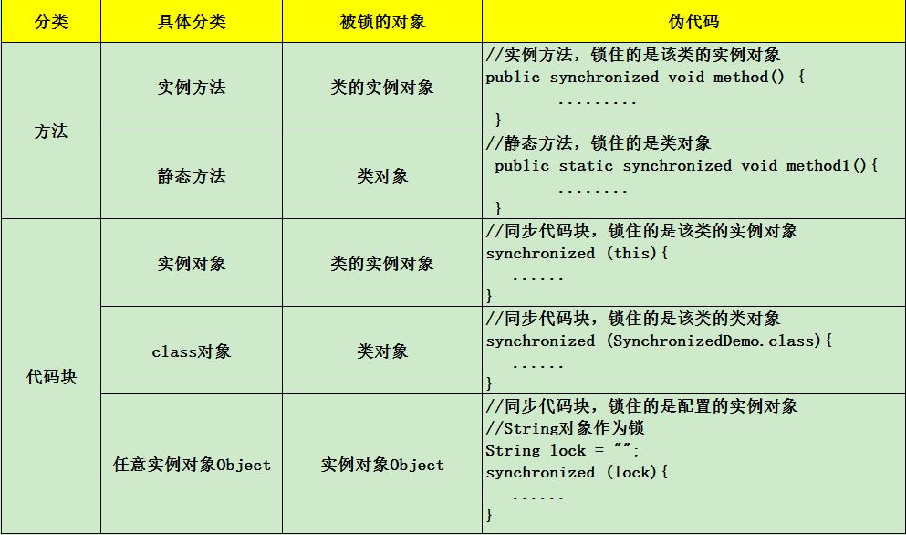

# 锁

## 介绍
- [redisson](https://github.com/redisson/redisson/wiki/%E7%9B%AE%E5%BD%95)
- java
- sql

## 线程同步:synchronized
 /ˈsɪŋkrənaɪzd/ 
 
 synchronized是Java中的关键字，是一种同步锁。它修饰的对象有以下几种： 
 
- 修饰一个代码块，被修饰的代码块称为同步语句块，其作用的范围是大括号{}括起来的代码，作用的对象是调用这个代码块的对象； 
- 修饰一个方法，被修饰的方法称为同步方法，其作用的范围是整个方法，作用的对象是调用这个方法的对象； 
- 修改一个静态的方法，其作用的范围是整个静态方法，作用的对象是这个类的所有对象； 
- 修改一个类，其作用的范围是synchronized后面括号括起来的部分，作用主的对象是这个类的所有对象。

### 为什么要使用synchronized
在并发编程中存在线程安全问题，主要原因有：
- 1.存在共享数据 
- 2.多线程共同操作共享数据。

关键字synchronized可以保证在同一时刻，只有一个线程可以执行某个方法或某个代码块，同时synchronized可以保证一个线程的变化可见（可见性），
### 实现原理
synchronized可以保证方法或者代码块在运行时，同一时刻只有一个方法可以进入到临界区，同时它还可以保证共享变量的内存可见性
### synchronized的作用
Synchronized是Java中解决并发问题的一种最常用最简单的方法 ，他可以确保线程互斥的访问同步代码
### 修饰一个方法
Synchronized修饰一个方法很简单，就是在方法的前面加synchronized，public synchronized void method(){}; synchronized修饰方法和修饰一个代码块类似，
只是作用范围不一样，修饰代码块是大括号括起来的范围，而修饰方法范围是整个函数。如将的run方法改成如下的方式，实现的效果一样。

    public synchronized void run() {
           {
                for (int i = 0; i < 5; i++) {
                    try {
                        System.out.println("线程名:"+Thread.currentThread().getName() + ":" + (count++));
                        Thread.sleep(100);
                    } catch (InterruptedException e) {
                        e.printStackTrace();
                    }
                }
            }
        }
Synchronized作用于整个方法的写法。

写法一:
    
     public synchronized void method()
     {
        // todo
     }

写法二:

    public void method()
    {
       synchronized(this) {
          
       }
    }
写法一修饰的是一个方法，写法二修饰的是一个代码块，但写法一与写法二是等价的，都是锁定了整个方法时的内容。

在用synchronized修饰方法时要注意以下几点： 

- synchronized关键字不能继承。 

虽然可以使用synchronized来定义方法，但synchronized并不属于方法定义的一部分，因此，synchronized关键字不能被继承。如果在父类中的某个方法使用了synchronized关键字，
而在子类中覆盖了这个方法，在子类中的这个方法默认情况下并不是同步的，而必须显式地在子类的这个方法中加上synchronized关键字才可以。
当然，还可以在子类方法中调用父类中相应的方法，这样虽然子类中的方法不是同步的，但子类调用了父类的同步方法，因此，子类的方法也就相当于同步了。这两种方式的例子代码如下： 
在子类方法中加上synchronized关键字

    class Parent {
       public synchronized void method() { }
    }
    class Child extends Parent {
       public synchronized void method() { }
    }

在子类方法中调用父类的同步方法

    class Parent {
       public synchronized void method() {   }
    }
    class Child extends Parent {
       public void method() { super.method();   }
    }
在定义接口方法时不能使用synchronized关键字。构造方法不能使用synchronized关键字，但可以使用synchronized代码块来进行同步。

### 修饰一个静态的方法
Synchronized也可修饰一个静态方法，用法如下：

    public synchronized static void method() {
       
    }
我们知道静态方法是属于类的而不属于对象的。同样的，synchronized修饰的静态方法锁定的是这个类的所有对象。

### 修饰一个类
效果和synchronized修饰静态方法是一样的，synchronized作用于一个类T时，是给这个类T加锁，T的所有对象用的是同一把锁。

[总结](https://www.cnblogs.com/weibanggang/p/9470718.html):

- 无论synchronized关键字加在方法上还是对象上，如果它作用的对象是非静态的，则它取得的锁是对象；
如果synchronized作用的对象是一个静态方法或一个类，则它取得的锁是对类，该类所有的对象同一把锁。 
- 每个对象只有一个锁（lock）与之相关联，谁拿到这个锁谁就可以运行它所控制的那段代码。 
- 实现同步是要很大的系统开销作为代价的，甚至可能造成死锁，所以尽量避免无谓的同步控制

## [CAS操作](https://www.jianshu.com/p/d53bf830fa09)
### 什么是CAS?
使用锁时，线程获取锁是一种悲观锁策略，即假设每一次执行临界区代码都会产生冲突，所以当前线程获取到锁的时候同时也会阻塞其他线程获取该锁。
而CAS操作（又称为无锁操作）是一种乐观锁策略，它假设所有线程访问共享资源的时候不会出现冲突，既然不会出现冲突自然而然就不会阻塞其他线程的操作。
因此，线程就不会出现阻塞停顿的状态。那么，如果出现冲突了怎么办？无锁操作是使用CAS(compare and swap)又叫做比较交换来鉴别线程是否出现冲突，
出现冲突就重试当前操作直到没有冲突为止。
### CAS的操作过程

CAS比较交换的过程可以通俗的理解为CAS(V,O,N)，包含三个值分别为：V 内存地址存放的实际值；O 预期的值（旧值）；N 更新的新值。
当V和O相同时，也就是说旧值和内存中实际的值相同表明该值没有被其他线程更改过，即该旧值O就是目前来说最新的值了，自然而然可以将新值N赋值给V。
反之，V和O不相同，表明该值已经被其他线程改过了则该旧值O不是最新版本的值了，所以不能将新值N赋给V，返回V即可。当多个线程使用CAS操作一个变量是，
只有一个线程会成功，并成功更新，其余会失败。失败的线程会重新尝试，当然也可以选择挂起线程

CAS的实现需要硬件指令集的支撑，在JDK1.5后虚拟机才可以使用处理器提供的CMPXCHG指令实现。

    Synchronized VS CAS

元老级的Synchronized(未优化前)最主要的问题是：在存在线程竞争的情况下会出现线程阻塞和唤醒锁带来的性能问题，
因为这是一种互斥同步（阻塞同步）。而CAS并不是武断的将线程挂起，当CAS操作失败后会进行一定的尝试，而非进行耗时的挂起唤醒的操作，因此也叫做非阻塞同步。这是两者主要的区别。

### CAS的应用场景
在J.U.C包中利用CAS实现类有很多，可以说是支撑起整个concurrency包的实现，在Lock实现中会有CAS改变state变量，在atomic包中的实现类也几乎都是用CAS实现，
### CAS的问题

#### ABA问题
因为CAS会检查旧值有没有变化，这里存在这样一个有意思的问题。比如一个旧值A变为了成B，然后再变成A，刚好在做CAS时检查发现旧值并没有变化依然为A，但是实际上的确发生了变化。解决方案可以沿袭数据库中常用的乐观锁方式，添加一个版本号可以解决。原来的变化路径A->B->A就变成了1A->2B->3C。java这么优秀的语言，当然在java 1.5后的atomic包中提供了AtomicStampedReference来解决ABA问题，解决思路就是这样的。

#### 自旋时间过长

使用CAS时非阻塞同步，也就是说不会将线程挂起，会自旋（无非就是一个死循环）进行下一次尝试，如果这里自旋时间过长对性能是很大的消耗。如果JVM能支持处理器提供的pause指令，那么在效率上会有一定的提升。

#### 只能保证一个共享变量的原子操作

当对一个共享变量执行操作时CAS能保证其原子性，如果对多个共享变量进行操作,CAS就不能保证其原子性。有一个解决方案是利用对象整合多个共享变量，即一个类中的成员变量就是这几个共享变量。然后将这个对象做CAS操作就可以保证其原子性。atomic中提供了AtomicReference来保证引用对象之间的原子性。

## 多线程
最近手上拿到一个程序，其中是一个视频监控的小程序，其中调用了线程，但是调试的时候出现的BUG，调试了N久，无果。最后，我把线程函数用一个普通的函数替代了，
就没有错误了，后来，变思索，此处为何要用线程，不用不行吗？调用线程的有何优点？何时适用？

CPU是以时间片的方式为进程分配CUP处理时间的，当一个进程以同步的方式去完成几件事情时，此进程必须完成了第一件事情以后再做第二件事，如此按顺序地向CPU请求完成要做的事情。
在此单线程的工作模式下，如果把CUP看作是一共有100个时间片的话，CPU可能一直都只是花了其中的10个时间片来处理当前进程所要做的事情，只是用到了CPU的10%的时间片，
而其他时间都白白浪费了，当然，实际上CPU的工作模式还是做完一件事以后再去做另一件事，只是CUP的处理速度非常快，很快就处理完成所请求的情事。

为了提高CPU的使用率，采用多线程的方式去同时完成几件事情而互不干扰，如当前进程要完成三件事情1、2、3，那么CPU会分别用10%的时间来同时处理这3件事情，
从而让CPU的使用率达到了30%，大大地提高了CPU的利用率。多线程的好处在处理一些特殊的场合其优势尤其明显。比如下载文件，你要一边下载一边显示进度一边保存，
在这种情况下，如果没有用多线程的话，没有意外的话一般都会把主线程阻塞，比如进度条的进度根本没有随着已下载的量而变化，堪至是整个窗体都动不了，
用多线程就可以很好地解决这个问题。

这里有一个生活实例可能更好地去理解多线程：回去看你女朋友做饭，正常的话她都会把洗好的菜（肉）先放到锅里煮，然后一边洗别的菜或处理别的事情，
如：洗碗、收拾桌台准备开饭，人还是一个人，但她同时做几件事情，这样就可以大大地提高效率。总的一句话就是：CPU还是要花同样多的时间去完成所有的事情，
但多线程可以让CPU掺插地同时做多件事情，在视觉上让用户觉得计算机在同时帮他处理多件事情，更好地改善用户体验。

了解了多线程的好处以后，就要了解应该在什么样的情况下使用多线程技术。因为并不是说所有情况下用多线程都是好事，因为多线程的情况下，
CPU还要花时间去维护，CPU处理各线程的请求时在线程间的切换也要花时间，所以一般情况下是可以不用多线程的，用了有时反而会得不偿失。
多线程可以很大程度的提高计算机系统的利用效率,大多情况下，要用到多线程的主要是需要处理大量的IO操作时或处理的情况需要花大量的时间等等，比如：读写文件、视频图像的采集、处理、显示、保存,迅雷下载等。

何时使用多线程技术,何时避免用它,是我们需要掌握的重要课题。多线程技术是一把双刃剑,在使用时需要充分考虑它的优缺点。

多线程处理可以同时运行多个线程。多线程应用程序将程序划分成多个独立的任务

是否需要创建多个线程取决于各种因素。在以下情况下,最适合采用多线程处理: 

- 耗时或大量占用处理器的任务阻塞用户界面操作
- 各个任务必须等待外部资源 (如远程文件或 Internet连接)

### 优点：
- 多线程技术使程序的响应速度更快 ,因为用户界面可以在进行其它工作的同时一直处于活动状态;
- 当前没有进行处理的任务时可以将处理器时间让给其它任务;
- 占用大量处理时间的任务可以定期将处理器时间让给其它任务;
- 可以随时停止任务;
- 可以分别设置各个任务的优先级以优化性能。

### 缺点
同样的 ,多线程也存在许多缺点 ,在考虑多线程时需要进行充分的考虑。多线程的主要缺点包括: 

- 等候使用共享资源时造成程序的运行速度变慢。这些共享资源主要是独占性的资源 ,如打印机等。
- 对线程进行管理要求额外的 CPU开销。线程的使用会给系统带来上下文切换的额外负担。当这种负担超过一定程度时,多线程的特点主要表现在其缺点上,比如用独立的线程来更新数组内每个元素。
- 线程的死锁。即较长时间的等待或资源竞争以及死锁等多线程症状。
- 对公有变量的同时读或写。当多个线程需要对公有变量进行写操作时,后一个线程往往会修改掉前一个线程存放的数据,从而使前一个线程的参数被修改;另外 ,当公用变量的读写操作是非原子性时,在不同的机器上,中断时间的不确定性,会导致数据在一个线程内的操作产生错误,从而产生莫名其妙的错误,而这种错误是程序员无法预知的。

### 创建线程
创建线程,实现Runnable接口,线程要执行的操作代码需要写在run()方法中,并通过start()方法来启动线程.
    写法1. new Thread(new Runnable() {
             public void run() {
                  test.method2();
              }
          }).start();
          
    写法2.new Thread(test::method2).start();

    写法3.ExecutorService pool = Executors.newCachedThreadPool();
      pool.execute(new Runnable() {
            public void run() {
            }
     );
 
 #### JAVA 8 '::' 关键字
|语法种类|示例|
|----|----|
|引用静态方法|ContainingClass::staticMethodName|
|引用特定对象的实例方法|containingObject::instanceMethodName|
|引用特定类型的任意对象的实例方法|ContainingType::methodName|
|引用构造函数|ClassName::new|

### 线程的状态
一个正在运行的线程因为某种原因不能继续运行时进入阻塞状态,即不可运行的状态,调用thread方法的sleep()方法可使线程进入不可运行的状态.

### 线程调度
当同一时刻有多个线程处于可运行状态,他们需要排队等待CPU资源,每个线程自动获得一个线程的优先级,优先级的高低放映线程的重要或紧急程度,可运行状态的线程按优先级排队,线程调度依据优先级基础上的”先到先服务”的原则.

线程调度管理器负责线程排队和CPU在线程间的分配,并按线程调度算法进行调度,当线程调度管理器选中某个线程时,该线程获得CPU资源进入可运行状态,

线程调度室抢占调度,即如果在当前线程执行过程中一个更高级优先级的线程进入可运行状态,则这个更高优先级的宣称立即调度执行.进行调度的方法:join,sleep,yield(),setPriority方法进行优先级设置
用户的每一次请求，都是一个线程,Thread类有大量的static方法,可直接调用,比如当前线程:Thread.currentThread();

### 线程同步
当一些同时运行的线程需要共享数据此时需要考虑其他线程的状态和行为,否者不能保证程序运行的结果的正确性.比如同一银行账户的多个取款卡,当两个或多个线程需要访问同一资源时需要某种顺序来确保该资源同一时刻只能被一个线程使用的方式称为线程同步.

使用关键字synchronized实现,被他修饰的方法或代码块其实就是在该方法或代码块里加一把锁,其所声明的方法只能有一个处于可执行状态

    
### 线程间通信
在很多现实问题中要求不仅要同步访问同一共享资源,而且线程间还彼此牵制,相互通信和依赖.建立在同步的基础上,实现不同线程之间的消息传递方法有wait(),notify().

    Wait()退出运行态，放弃资源锁，进入到等待队列
    Notify()从等待序列中唤起一个线程
## [ExecutorService 的理解和使用](https://www.cnblogs.com/jfaith/p/11114470.html)
前言：

我们之前使用线程的时候都是使用new Thread来进行线程的创建，但是这样会有一些问题。如：

a. 每次new Thread新建对象性能差。

b. 线程缺乏统一管理，可能无限制新建线程，相互之间竞争，及可能占用过多系统资源导致死机或oom。

c. 缺乏更多功能，如定时执行、定期执行、线程中断。

相比new Thread，Java提供的四种线程池的好处在于：

a. 重用存在的线程，减少对象创建、消亡的开销，性能佳。

b. 可有效控制最大并发线程数，提高系统资源的使用率，同时避免过多资源竞争，避免堵塞。

c. 提供定时执行、定期执行、单线程、并发数控制等功能。

而我们今天来学习和掌握另外一个新的技能，特别像一个线程池的一个接口类ExecutorService，下面我们来了解下java中Executors的线程池

Java通过Executors提供四种线程池，分别为：
- newCachedThreadPool创建一个可缓存线程池，如果线程池长度超过处理需要，可灵活回收空闲线程，若无可回收，则新建线程。
- newFixedThreadPool 创建一个定长线程池，可控制线程最大并发数，超出的线程会在队列中等待。
- newScheduledThreadPool 创建一个定长线程池，支持定时及周期性任务执行。
- newSingleThreadExecutor 创建一个单线程化的线程池，它只会用唯一的工作线程来执行任务，保证所有任务按照指定顺序(FIFO, LIFO, 优先级)执行。

## 悲观锁与乐观锁

悲观锁：总是假设最坏的情况，每次去拿数据的时候都认为别人会修改，所以每次在拿数据的时候都会上锁，这样别人想拿这个数据就会阻塞直到它解锁。
传统的关系型数据库里边就用到了很多这种锁机制，比如行锁，表锁等，读锁，写锁等，都是在做操作之前先上锁。就像for update，
再比如Java里面的同步原语synchronized关键字的实现也是悲观锁。

乐观锁：顾名思义，就是很乐观，每次去拿数据的时候都认为别人不会修改，所以不会上锁，但是在更新的时候会判断一下在此期间别人有没有去更新这个数据，可以使用版本号等机制。
乐观锁适用于多读的应用类型，这样可以提高吞吐量，像数据库提供的类似于write_condition机制，其实都是提供的乐观锁。

## for update
### 定义
for update是一种行级锁，又叫排它锁，一旦用户对某个行施加了行级加锁，则该用户可以查询也可以更新被加锁的数据行，其它用户只能查询但不能更新被加锁的数据行．
如果其它用户想更新该表中的数据行，则也必须对该表施加行级锁．即使多个用户对一个表均使用了共享更新，但也不允许两个事务同时对一个表进行更新，真正对表进行更新时，
是以独占方式锁表，一直到提交或复原该事务为止。行锁永远是独占方式锁。

只有当出现如下之一的条件，才会释放共享更新锁：
- 1、执行提交（COMMIT）语句
- 2、退出数据库（LOG　OFF）
- 3、程序停止运行

### 概念
通常情况下，select语句是不会对数据加锁，妨碍影响其他的DML和DDL操作。

而select … for update 语句是我们经常使用手工加锁语句。在数据库中执行select … for update ,大家会发现会对数据库中的表或某些行数据进行锁表，
在mysql中，如果查询条件带有主键，会锁行数据，如果没有，会锁表。