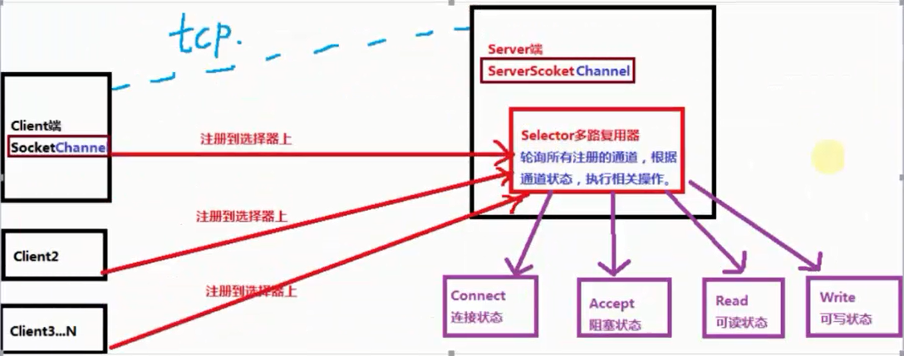
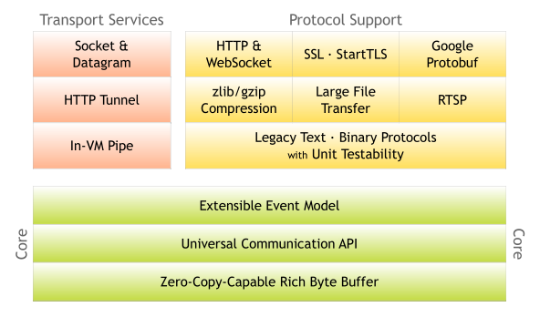

# 网络编程学习

## 传统的同步阻塞式I/O编程
socket又称”套接字”,应用程序通过套接字	向网络发出请求,或者应答网络请求,它们之间可以分为四个步骤,服务器监听,客户端请求服务器,服务器端确认,客户端确认,进行通信
- (1)	服务器监听:是服务器端套接字并不定位具体的客户端套接字,而是处于等待连接的状态,实时监控网络状态,
- (2)	客户端请求:是指客户端的套接字提出连接请求,要连接的目标是服务器端的套接字,为此,客户端的套接字必须首先描述它要连接的服务器端的套接字,指出服务器端套接字的地址和端口,然后向服务器端套接字提出连接请求
- (3)	服务器端连接确认:服务器端套接字监听到或者说接收到客户端套接字的链接请求它就响应客户端套接字的请求,建立一个新的线程,把服务器端套接字的描述发给客户端
- (4)	客户端连接确认:一旦客户端确认了此描述,连接就建立好了,双方开始进行通信,而服务器端套接字继续处于监听状态,继续接受其他客户端套接字的连接请求

tcp一般点对点的链接,socket属于点对点连接通信,古老的socket不支持过多的连接,程,window一般是1000个线程,linux2000个线程,,udp属于广播式通信,底层也是tcp,
拓展:netty, mina,hdfs,fastdfs
jdk1.5以后出现NIO

## NIO
### IO(BIO)和NIO的区别
其本质就是阻塞与非阻塞的区别
阻塞概念:
应用程序在获取网络数据的时候,如果网络传输数据(网络带宽或者传输效率)很慢,那么程序就一直等着,直到传输完毕为止
非阻塞概念:
应用程序直接可以获取已经准备好的数据(服务端数据事先存入buffer缓存区),无需等待	

BIO为同步阻塞形式,NIO为同步非阻塞形式,NIO并没有实现异步,在JDK1.7之后,升级了NIO库包,支持异步非阻塞通信模型即NIO2.0(AIO)

同步和异步:同步和异步一般是面对操作系统与应用程序对IO操作的层面上来区别的

同步时,应用程序会直接参与IO读写操作,并且我们的应用程序会直接阻塞到某一个方法上,直到数据准备就绪;或者采用轮询的策略实时检查数据的就绪状态,如果就绪则获取数据

异步时,则所有的IO读写操作交给操作系统处理,与我们的应用程序没有直接关系,我们程序不需要关心IO读写,当操作系统完成了IO读写操作时,会给我们应用程序发送通知,我们的应用程序直接拿走数据即可

同步说的是你的server服务器端的执行方式

阻塞说的是具体的技术,接受数据的方式,状态(io,nio)

在介绍NIO之前,先澄清一个概念,NIO叫Non-block IO既非阻塞IO学习NIO编程之前先要了解几个概念

Buffer(缓冲区),channel(管道,通道),Selector(选择器,多路复用器)

### Buffer
Buffer是一个对象,它包含一些要写入或者要读取的数据,在NIO类库中加入Buffer对象,体现了新库与原IO的一个重要的区别,在面向流的IO中,可以将数据直接写入或者读取到Stream对象中,在NIO库中,所有数据都是用缓冲区处理的(读写),缓冲区实质上是一个数组,通常它是一个字节数组(ByteBuffer),也可以使用其他类型的数组,这个数组为缓冲区提供了数据的访问读写等操作属性,如位置,容量,上限等概念,参考API文档
Buffer类型:我们最常用的是ByteBuffer,实际上每一种java基本类型都对应了一种缓冲区(除了Boolean类型)
ByteBuffer
CharBuffer
ShortBuffer
IntBuffer
LongBuffer
FloatBuffer
DoubleBuffer

### channel
通道（Channel)，它就像自来水管道一样，网络数据通过Channel读取和写入，通 道与流不同之处在于通道是双向的，而流只是一个方向上移动（一个流必须是 InputStream或者OutputStream的子类），而通道可以用于读、写或者二者同时进行, 最关键的是可以与多路复用器结合起来，有多种的状态位，方便多路复用器去识别。 事实上通道分为两大类，一类是网络读写的（SelectableChannel)，一类是用于文 件操作的（FlleChannel)，我们使用的SocketChannel和ServerSockerChannel都 是 SelectableChannel 的子类。
### Selector
多路复用器（Selector)，他是NIO编程的基础，非常重要。多路复用器提供 选择己经就绪的任务的能力。 简单说，就是Selector会不断地轮询注册在其上的通道（Channel），如果 某个通道发生了读写操作，这个通道就处于就绪状态，会被Selector轮询出 来，然后通过SelectionKey可以取得就绪的Channel集合，从而进行后续的 IO操作。 —个多路复用器（Selector)可以负责成千上万Channel通道，没有上限， 这也是JDK使用了 epoll代替了传统的select实现，获得连接句柄没有限制。 这也就意味着我们只要一个线程负责Selector的轮询，就可以接入成千上万 个客户端，这是JDKNIO库的巨大进步。
Selector线程就类似一个管理者（Master),管理了成千上万个管道，然后 轮询哪个管道的数据己经准备好，通知cpu执行IO的读取或写入操作。 
Selector模式:当IO事件（管道）注册到选择器以后，selector会分配给每个 管道一个key值，相当于标签。selector选择器是以轮询的方式进行査找注册 的所有IO事件（管道），当我们的IO事件（管道）准备就绪后，select就会 识别，会通过key值来找到相应的管道，进行相关的数据处理操作（从管道里 读或写数据，写到我们的数据缓冲区中）。
每个管道都会对选择器进行注册不同的事件状态，以便选择器査找。

    SelectionKey.OP_CONNECT 
    SelectionKey.OP_ACCEPT 
    SelectionKey.OP_READ 
    SelectionKey.OP_WRITE

## AIO
   
AIO编程，在NIO基础之上引入了异步通道的概念，并提供了异步文件和异步 套接字通道的实现，从而在真正意义上实现了异步非阻塞，之前我们学习的 NIO只是非阻塞而并非异步。而AIO它不需要通过多路复用器对注册的通道进 行轮询操作即可实现异步读写，从而简化了NIO编程模型。也可以称之为 NIO2.0,这种模式才真正的属于我们异步非阻塞的模型。 AsynchronousServerScoketChannel
AsynchronousScoketChanel

## Netty
我们己经了解了 Socket通信/IO/nio/aio编程，对于通信模型己经有了一个初 步的认识。其实我们之前所学习的仅仅是一个模型，如果想把这些真正的用 于实际工作中去，那么还需要不断的完善、扩展和优化。比如很经典的Tcp读 包写包问题，或者是数据接收的大小，实际的通信读取与应答的处理逻辑等 等一些细节问题斋要我们认真的去思考，而这些我们都需要大量的时间和经 历，以及丰富的经验。所以想学好socket通信不是件容易的事情，那么现在， 我们就要学习一门新的技术Netty,我们为什么选择Netty,原因无他，简 单！我们再也不必去编写复杂的代码逻辑去实现通信，我们再也不需要去考 虑性能问題，不需要考虑编解码问题，半包读写问题等，这些强大的Netty己 经帮我们实现好了，我们只需要使用即可。 Netty是也就最流行的NIO框架，他的健壮性、功能、性能、可定制性和可扩 展性在同类框架都是首屈一指的。它己经得到成百上千的商业/商用项目验证， 如Hadoop的RPC框架Avro、以及我们之后学习的JMS框架，强大的 RocketMQq还有主流的分布式通信框架Dubbox等等。

Netty是基于Java NIO的网络应用框架。 Netty是一个NIO client-server(客户端服务器)框架，使用Netty可以快速开发 网络应用，例如服务器和客户端协议。Netty提供了一种新的方式来使开发网 络应用程序，这种新的方式使得它很容易使用和有很强的扩展性。Netty的内 部实现是很复杂的，但是Netty提供了简单易用的api从网络处理代码中解耦 业务逻辑。Netty是完全基于NIO实现的，所以整个Netty都是异步的。 网络应用程序通常需要有较高的可扩展性，无论是Netty还是其他的基于Java NIO的框架，都会提供可扩展性的解决方案。Netty中一个关键组成部分是它 的异步特性，本章将讨论同步(阻塞)和异步(非阻塞)的IO来说明为什么使用异 步代码来解决扩展性问题以及如何使用异步。

在学习Netty之前，我们先回顾下NIO通信步骤： 

- 1创建ServerSocketChannel,为它配置 非阻塞模式 
- 2绑定监听，配置TCP参数，录入backlog大小等 
- 3创建一个独立的IO线程，用于轮询多路复用器Selector 
- 4创建Selector,将之前创建的ServerSocketChannel注册到Selector上，并设置监听标识位 SelectionKey.ACCEPT 
- 5启动I0线程，在循环体	中执行Selector.select()方法，轮谁就绪的通道 
- 6当轮询到了处于就绪的通道时，需要进行判断操作位，如果是ACCEPTS态，说明是新的客户端接入，则调用accept方法接受新的客户端。 
- 7设置新接入客户端的一些参数，如非阻塞、并将其通道继续注册到Selector之中，设置监听标识位等 
- 8如果轮询的通道揉作位是READ,则进行读取，构诰Buffer对象等 
- 9更细节的还有数据没发送完成继续发送的问题...
〇k，一个简单的NIO服务器端程序，就是如此的复制，下面我们看看Netty完成这件事 情需要几个步驟。
 
### 安装JDK7
下载地址：I http://www.oracle.com/technetwork/java/Javase/archlve-139210.html
### 下载netty包
下载地址：http://netty.io/

## Netty实现通信的步骤：
- 1创建两个的NI0线程组,一个专门用于网络亊件处理（接受客户端的»，另一个则进行网露通信读写
- 2 创建一个ServerBootstrap对象，配置Netty的一系列参数，例如接受传出数据的缓存大小等等
- 3创建一个实际处理数据的类:Channellnitializer,进行初始化的准备工作， 比如设置接受传出数据的字符集、格式、已经实际处理数据的接口 •
- 4绑定端口，执行同步阻塞方法等待服务器端启动即可.

如此简单的四个步骤,我们的服务器端就编写完成了,几十行代码就可以把他完成的健壮,性能稳定,这在我们之前NIO学习的时候是不可能的
[解读Netty示例](http://ifeve.com/netty5-user-guide/)

# [彻底理解同步 异步 阻塞 非阻塞](https://www.cnblogs.com/loveer/p/11479249.html)
## 1.IO操作
IO分两阶段（一旦拿到数据后就变成了数据操作，不再是IO）：
    1.数据准备阶段
    2.内核空间复制数据到用户进程缓冲区（用户空间）阶段

在操作系统中，程序运行的空间分为内核空间和用户空间。
    应用程序都是运行在用户空间的，所以它们能操作的数据也都在用户空间。

阻塞IO和非阻塞IO的区别在于第一步发起IO请求是否会被阻塞：
    如果阻塞直到完成那么就是传统的阻塞IO，如果不阻塞，那么就是非阻塞IO。

一般来讲：
    阻塞IO模型、非阻塞IO模型、IO复用模型(select/poll/epoll)、信号驱动IO模型都属于同步IO，因为阶段2是阻塞的(尽管时间很短)。

同步IO和异步IO的区别就在于第二个步骤是否阻塞：
    如果不阻塞，而是操作系统帮你做完IO操作再将结果返回给你，那么就是异步IO

## 2.同步和异步IO 阻塞和非阻塞IO

同步和异步IO的概念：

	同步是用户线程发起I/O请求后需要等待或者轮询内核I/O操作完成后才能继续执行

	异步是用户线程发起I/O请求后仍需要继续执行，当内核I/O操作完成后会通知用户线程，或者调用用户线程注册的回调函数

阻塞和非阻塞IO的概念：

	阻塞是指I/O操作需要彻底完成后才能返回用户空间

	非阻塞是指I/O操作被调用后立即返回一个状态值，无需等I/O操作彻底完成

## 3.同步与异步（线程间调用）

同步与异步是对应于调用者与被调用者，它们是线程之间的关系，两个线程之间要么是同步的，要么是异步的

	同步操作时，调用者需要等待被调用者返回结果，才会进行下一步操作

	而异步则相反，调用者不需要等待被调用者返回调用，即可进行下一步操作，被调用者通常依靠事件、回调等机制来通知调用者结果
## 4.阻塞与非阻塞（线程内调用）

阻塞与非阻塞是对同一个线程来说的，在某个时刻，线程要么处于阻塞，要么处于非阻塞

阻塞和非阻塞关注的是程序在等待调用结果（消息，返回值）时的状态：

    阻塞调用是指调用结果返回之前，当前线程会被挂起。调用线程只有在得到结果之后才会返回。

    非阻塞调用指在不能立刻得到结果之前，该调用不会阻塞当前线程。
## 5.同步与异步调用/线程/通信

同步就是两种东西通过一种机制实现步调一致，异步是两种东西不必步调一致

一、同步调用与异步调用：

    在用在调用场景中，无非是对调用结果的不同处理。

    同步调用就是调用一但返回，就能知道结果，而异步是返回时不一定知道结果，还得通过其他机制来获知结果，如：

        a. 状态 b. 通知 c. 回调函数

二、同步线程与异步线程：

    同步线程：即两个线程步调要一致，其中一个线程可能要阻塞等待另外一个线程的运行，要相互协商。快的阻塞一下等到慢的步调一致。

    异步线程：步调不用一致，各自按各自的步调运行，不受另一个线程的影响。

三、同步通信与异步通信：

    同步和异步是指：发送方和接收方是否协调步调一致

    同步通信是指：发送方和接收方通过一定机制，实现收发步调协调。
        如：发送方发出数据后，等接收方发回响应以后才发下一个数据包的通讯方式

    异步通信是指：发送方的发送不管接收方的接收状态。
        如：发送方发出数据后，不等接收方发回响应，接着发送下个数据包的通讯方式。

阻塞可以是实现同步的一种手段！例如两个东西需要同步，一旦出现不同步情况，我就阻塞快的一方，使双方达到同步。

同步是两个对象之间的关系，而阻塞是一个对象的状态。

###  6.四种组合方式

**同步阻塞方式：**
    发送方发送请求之后一直等待响应。
    接收方处理请求时进行的IO操作如果不能马上等到返回结果，就一直等到返回结果后，才响应发送方，期间不能进行其他工作。

**同步非阻塞方式：**
	发送方发送请求之后，一直等待响应。
	接受方处理请求时进行的IO操作如果不能马上的得到结果，就立即返回，取做其他事情。
	但是由于没有得到请求处理结果，不响应发送方，发送方一直等待。
	当IO操作完成以后，将完成状态和结果通知接收方，接收方再响应发送方，发送方才进入下一次请求过程。（实际不应用）

**异步阻塞方式：**
	发送方向接收方请求后，不等待响应，可以继续其他工作。
	接收方处理请求时进行IO操作如果不能马上得到结果，就一直等到返回结果后，才响应发送方，期间不能进行其他操作。 （实际不应用）

**异步非阻塞方式：**
	发送方向接收方请求后，不等待响应，可以继续其他工作。
	接收方处理请求时进行IO操作如果不能马上得到结果，也不等待，而是马上返回去做其他事情。
	当IO操作完成以后，将完成状态和结果通知接收方，接收方再响应发送方。（效率最高）

