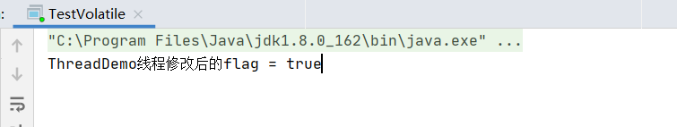
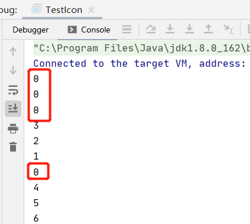
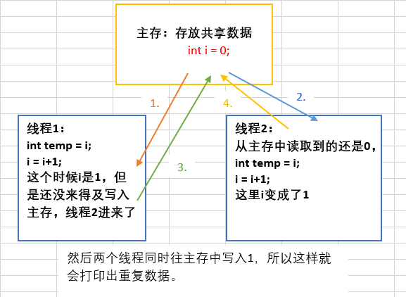
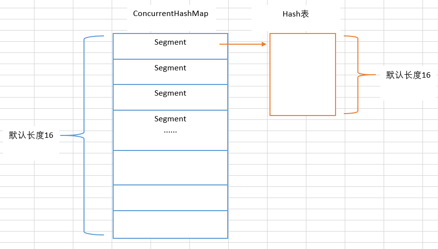
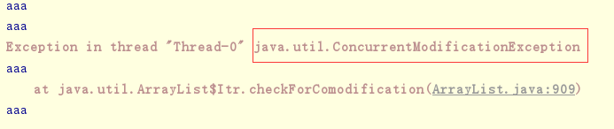
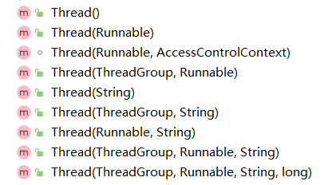

# 多线程

最近手上拿到一个程序，其中是一个视频监控的小程序，其中调用了线程，但是调试的时候出现的BUG，调试了N久，无果。最后，我把线程函数用一个普通的函数替代了，
就没有错误了，后来，变思索，此处为何要用线程，不用不行吗？调用线程的有何优点？何时适用？

CPU是以时间片的方式为进程分配CUP处理时间的，当一个进程以同步的方式去完成几件事情时，此进程必须完成了第一件事情以后再做第二件事，如此按顺序地向CPU请求完成要做的事情。
在此单线程的工作模式下，如果把CUP看作是一共有100个时间片的话，CPU可能一直都只是花了其中的10个时间片来处理当前进程所要做的事情，只是用到了CPU的10%的时间片，
而其他时间都白白浪费了，当然，实际上CPU的工作模式还是做完一件事以后再去做另一件事，只是CUP的处理速度非常快，很快就处理完成所请求的情事。

为了提高CPU的使用率，采用多线程的方式去同时完成几件事情而互不干扰，如当前进程要完成三件事情1、2、3，那么CPU会分别用10%的时间来同时处理这3件事情，
从而让CPU的使用率达到了30%，大大地提高了CPU的利用率。多线程的好处在处理一些特殊的场合其优势尤其明显。比如下载文件，你要一边下载一边显示进度一边保存，
在这种情况下，如果没有用多线程的话，没有意外的话一般都会把主线程阻塞，比如进度条的进度根本没有随着已下载的量而变化，堪至是整个窗体都动不了，
用多线程就可以很好地解决这个问题。

这里有一个生活实例可能更好地去理解多线程：回去看你女朋友做饭，正常的话她都会把洗好的菜（肉）先放到锅里煮，然后一边洗别的菜或处理别的事情，
如：洗碗、收拾桌台准备开饭，人还是一个人，但她同时做几件事情，这样就可以大大地提高效率。总的一句话就是：CPU还是要花同样多的时间去完成所有的事情，
但多线程可以让CPU掺插地同时做多件事情，在视觉上让用户觉得计算机在同时帮他处理多件事情，更好地改善用户体验。

了解了多线程的好处以后，就要了解应该在什么样的情况下使用多线程技术。因为并不是说所有情况下用多线程都是好事，因为多线程的情况下，
CPU还要花时间去维护，CPU处理各线程的请求时在线程间的切换也要花时间，所以一般情况下是可以不用多线程的，用了有时反而会得不偿失。
多线程可以很大程度的提高计算机系统的利用效率,大多情况下，要用到多线程的主要是需要处理大量的IO操作时或处理的情况需要花大量的时间等等，比如：读写文件、视频图像的采集、处理、显示、保存,迅雷下载等。

何时使用多线程技术,何时避免用它,是我们需要掌握的重要课题。多线程技术是一把双刃剑,在使用时需要充分考虑它的优缺点。

多线程处理可以同时运行多个线程。多线程应用程序将程序划分成多个独立的任务

是否需要创建多个线程取决于各种因素。在以下情况下,最适合采用多线程处理: 

- 耗时或大量占用处理器的任务阻塞用户界面操作
- 各个任务必须等待外部资源 (如远程文件或 Internet连接)

## 我的理解-锁与多线程
对于批量的数据比如批量删除操作,和大量的并发请求,比如大量用户访问资源,怎么让服务器的cpu利用率提高,同时处理多个请求或者执行程序,让用户感觉不到程序执行花费的时间,
让这个进程分出多个线程,同时处理程序逻辑.多线程是为了异步和优化性能,

在多线程的环境下,一段程序如果执行完以后才能下一个线程执行,避免其他线程干扰,比如同一个资源(比如数据库记录)的操作,一个用户对资源执行了批量更新操作,需要等待很长时间,另一个用户也对这个资源
更新,为了避免混乱,给执行的逻辑加锁,保证只能一个线程执行,redis可以作为锁,以资源id做为一个key,执行程序时,设置这个id为key,执行完后删除这个key,其他线程执行程序时先判断redis中有没有这个
资源id的key,有的话,提醒用户这个资源正在操作.被锁定.

长时间运行的任务需要单独开辟线程，并向前台报告进度

## 优点：

- 多线程技术使程序的响应速度更快 ,因为用户界面可以在进行其它工作的同时一直处于活动状态;
- 当前没有进行处理的任务时可以将处理器时间让给其它任务;
- 占用大量处理时间的任务可以定期将处理器时间让给其它任务;
- 可以随时停止任务;
- 可以分别设置各个任务的优先级以优化性能。

## 缺点
同样的 ,多线程也存在许多缺点 ,在考虑多线程时需要进行充分的考虑。多线程的主要缺点包括: 

- 等候使用共享资源时造成程序的运行速度变慢。这些共享资源主要是独占性的资源 ,如打印机等。
- 对线程进行管理要求额外的 CPU开销。线程的使用会给系统带来上下文切换的额外负担。当这种负担超过一定程度时,多线程的特点主要表现在其缺点上,比如用独立的线程来更新数组内每个元素。
- 线程的死锁。即较长时间的等待或资源竞争以及死锁等多线程症状。
- 对公有变量的同时读或写。当多个线程需要对公有变量进行写操作时,后一个线程往往会修改掉前一个线程存放的数据,从而使前一个线程的参数被修改;另外 ,当公用变量的读写操作是非原子性时,在不同的机器上,中断时间的不确定性,会导致数据在一个线程内的操作产生错误,从而产生莫名其妙的错误,而这种错误是程序员无法预知的。


## 创建线程
创建线程,实现Runnable接口,线程要执行的操作代码需要写在run()方法中,并通过start()方法来启动线程.

    写法1. new Thread(new Runnable() {
             public void run() {
                  test.method2();
              }
          }).start();
          
    或者 new Thread(test::method2).start();

    写法2.private static ExecutorService pool = Executors.newFixedThreadPool(Runtime.getRuntime().availableProcessors() * 2);
       或者: private ThreadPoolExecutor executor = executor = new ThreadPoolExecutor(1, Integer.MAX_VALUE, 60, TimeUnit.SECONDS, new ArrayBlockingQueue<Runnable>(5)){};

    Runnable task = () -> {
    	//to do
    };
    pool.execute(task);
    
    
    
    
    
    写法3:callable使用
      Callable callable = new Callable() {
               @Override
               public Object call() throws Exception {
                   return "this is Callable's message";
               }
           };
       //将callable丢进任务里面,用于接收运算结果
       FutureTask futureTask = new FutureTask(callable);
       //启动线程, 执行任务
       new Thread(futureTask).start();
       try {
           while (!futureTask.isDone()) {
               Thread.sleep(100);
           }
           System.out.println("执行任务后的结果: " + futureTask.get());
       } catch (InterruptedException e) {
           e.printStackTrace();
       } catch (ExecutionException e) {
           e.printStackTrace();
       }
   
 ### JAVA 8 '::' 关键字
|语法种类|示例|
|----|----|
|引用静态方法|ContainingClass::staticMethodName|
|引用特定对象的实例方法|containingObject::instanceMethodName|
|引用特定类型的任意对象的实例方法|ContainingType::methodName|
|引用构造函数|ClassName::new|

## 线程的状态
一个正在运行的线程因为某种原因不能继续运行时进入阻塞状态,即不可运行的状态,调用thread方法的sleep()方法可使线程进入不可运行的状态.

## 线程调度
当同一时刻有多个线程处于可运行状态,他们需要排队等待CPU资源,每个线程自动获得一个线程的优先级,优先级的高低放映线程的重要或紧急程度,可运行状态的线程按优先级排队,线程调度依据优先级基础上的”先到先服务”的原则.

线程调度管理器负责线程排队和CPU在线程间的分配,并按线程调度算法进行调度,当线程调度管理器选中某个线程时,该线程获得CPU资源进入可运行状态,

线程调度室抢占调度,即如果在当前线程执行过程中一个更高级优先级的线程进入可运行状态,则这个更高优先级的宣称立即调度执行.进行调度的方法:join,sleep,yield(),setPriority方法进行优先级设置
用户的每一次请求，都是一个线程,Thread类有大量的static方法,可直接调用,比如当前线程:Thread.currentThread();

## 线程同步
当一些同时运行的线程需要共享数据此时需要考虑其他线程的状态和行为,否者不能保证程序运行的结果的正确性.比如同一银行账户的多个取款卡,当两个或多个线程需要访问同一资源时需要某种顺序来确保该资源同一时刻只能被一个线程使用的方式称为线程同步.

使用关键字synchronized实现,被他修饰的方法或代码块其实就是在该方法或代码块里加一把锁,其所声明的方法只能有一个处于可执行状态

    
## 线程间通信
在很多现实问题中要求不仅要同步访问同一共享资源,而且线程间还彼此牵制,相互通信和依赖.建立在同步的基础上,实现不同线程之间的消息传递方法有wait(),notify().

    Wait()退出运行态，放弃资源锁，进入到等待队列
    Notify()从等待序列中唤起一个线程
   
   
   
    
# [ExecutorService线程池的理解和使用](https://www.cnblogs.com/jfaith/p/11114470.html)

我们使用线程时，需要new一个，用完了又要销毁，这样频繁的创建销毁也很耗资源，所以就提供了线程池。道理和连接池差不多，连接池是为了避免频繁的创建和释放连接，所以在连接池中就有一定数量的连接，要用时从连接池拿出，用完归还给连接池。线程池也一样。线程池中有一个线程队列，里面保存着所有等待状态的线程。下面来看一下用法：

```java
public class TestThreadPool {
    public static void main(String[] args) {
        ThreadPoolDemo tp = new ThreadPoolDemo();
        //1.创建线程池
        ExecutorService pool = Executors.newFixedThreadPool(5);
        //2.为线程池中的线程分配任务
        pool.submit(tp);
        //3.关闭线程池
        pool.shutdown();
    }
}

class ThreadPoolDemo implements Runnable {
    private int i = 0;
    @Override
    public void run() {
        while (i < 100) {
            System.out.println(Thread.currentThread().getName() + ":" + (i++));
        }
    }
}
```
线程池用法很简单，分为三步。首先用工具类Executors创建线程池，然后给线程池分配任务，最后关闭线程池就行了。

我们之前使用线程的时候都是使用new Thread来进行线程的创建，但是这样会有一些问题。如：

a. 每次new Thread新建对象性能差。

b. 线程缺乏统一管理，可能无限制新建线程，相互之间竞争，及可能占用过多系统资源导致死机或oom。

c. 缺乏更多功能，如定时执行、定期执行、线程中断。

相比new Thread，Java提供的四种线程池的好处在于：

a. 重用存在的线程，减少对象创建、消亡的开销，性能佳。

b. 可有效控制最大并发线程数，提高系统资源的使用率，同时避免过多资源竞争，避免堵塞。

c. 提供定时执行、定期执行、单线程、并发数控制等功能。

而我们今天来学习和掌握另外一个新的技能，特别像一个线程池的一个接口类ExecutorService，下面我们来了解下java中Executors的线程池

Java通过Executors提供四种线程池，分别为：
- newCachedThreadPool创建一个可缓存线程池，如果线程池长度超过处理需要，可灵活回收空闲线程，若无可回收，则新建线程。
- newFixedThreadPool 创建一个定长线程池，可控制线程最大并发数，超出的线程会在队列中等待。
- newScheduledThreadPool 创建一个定长线程池，支持定时及周期性任务执行。
- newSingleThreadExecutor 创建一个单线程化的线程池，它只会用唯一的工作线程来执行任务，保证所有任务按照指定顺序(FIFO, LIFO, 优先级)执行。


# 线程同步:synchronized
 /ˈsɪŋkrənaɪzd/ 
 
 synchronized是Java中的关键字，是一种同步锁。它修饰的对象有以下几种： 
 
- 修饰一个代码块，被修饰的代码块称为同步语句块，其作用的范围是大括号{}括起来的代码，作用的对象是调用这个代码块的对象； 
- 修饰一个方法，被修饰的方法称为同步方法，其作用的范围是整个方法，作用的对象是调用这个方法的对象； 
- 修改一个静态的方法，其作用的范围是整个静态方法，作用的对象是这个类的所有对象； 
- 修改一个类，其作用的范围是synchronized后面括号括起来的部分，作用主的对象是这个类的所有对象。

[](https://www.jianshu.com/p/d53bf830fa09)
## 为什么要使用synchronized
在并发编程中存在线程安全问题，主要原因有：
- 1.存在共享数据 
- 2.多线程共同操作共享数据。

关键字synchronized可以保证在同一时刻，只有一个线程可以执行某个方法或某个代码块，同时synchronized可以保证一个线程的变化可见（可见性），
## 实现原理
synchronized可以保证方法或者代码块在运行时，同一时刻只有一个方法可以进入到临界区，同时它还可以保证共享变量的内存可见性
## synchronized的作用
Synchronized是Java中解决并发问题的一种最常用最简单的方法 ，他可以确保线程互斥的访问同步代码
## 修饰一个方法
Synchronized修饰一个方法很简单，就是在方法的前面加synchronized，public synchronized void method(){}; synchronized修饰方法和修饰一个代码块类似，
只是作用范围不一样，修饰代码块是大括号括起来的范围，而修饰方法范围是整个函数。如将的run方法改成如下的方式，实现的效果一样。

    public synchronized void run() {
           {
                for (int i = 0; i < 5; i++) {
                    try {
                        System.out.println("线程名:"+Thread.currentThread().getName() + ":" + (count++));
                        Thread.sleep(100);
                    } catch (InterruptedException e) {
                        e.printStackTrace();
                    }
                }
            }
        }
Synchronized作用于整个方法的写法。

写法一:
    
     public synchronized void method()
     {
        // todo
     }

写法二:

    public void method()
    {
       synchronized(this) {
          
       }
    }
写法一修饰的是一个方法，写法二修饰的是一个代码块，但写法一与写法二是等价的，都是锁定了整个方法时的内容。

在用synchronized修饰方法时要注意以下几点： 

- synchronized关键字不能继承。 

虽然可以使用synchronized来定义方法，但synchronized并不属于方法定义的一部分，因此，synchronized关键字不能被继承。如果在父类中的某个方法使用了synchronized关键字，
而在子类中覆盖了这个方法，在子类中的这个方法默认情况下并不是同步的，而必须显式地在子类的这个方法中加上synchronized关键字才可以。
当然，还可以在子类方法中调用父类中相应的方法，这样虽然子类中的方法不是同步的，但子类调用了父类的同步方法，因此，子类的方法也就相当于同步了。这两种方式的例子代码如下： 
在子类方法中加上synchronized关键字

    class Parent {
       public synchronized void method() { }
    }
    class Child extends Parent {
       public synchronized void method() { }
    }

在子类方法中调用父类的同步方法

    class Parent {
       public synchronized void method() {   }
    }
    class Child extends Parent {
       public void method() { super.method();   }
    }
在定义接口方法时不能使用synchronized关键字。构造方法不能使用synchronized关键字，但可以使用synchronized代码块来进行同步。

## 修饰一个静态的方法
Synchronized也可修饰一个静态方法，用法如下：

    public synchronized static void method() {
       
    }
我们知道静态方法是属于类的而不属于对象的。同样的，synchronized修饰的静态方法锁定的是这个类的所有对象。

## 修饰一个类
效果和synchronized修饰静态方法是一样的，synchronized作用于一个类T时，是给这个类T加锁，T的所有对象用的是同一把锁。

[总结](https://www.cnblogs.com/weibanggang/p/9470718.html):

- 无论synchronized关键字加在方法上还是对象上，如果它作用的对象是非静态的，则它取得的锁是对象；
如果synchronized作用的对象是一个静态方法或一个类，则它取得的锁是对类，该类所有的对象同一把锁。 
- 每个对象只有一个锁（lock）与之相关联，谁拿到这个锁谁就可以运行它所控制的那段代码。 
- 实现同步是要很大的系统开销作为代价的，甚至可能造成死锁，所以尽量避免无谓的同步控制


#[JUC](https://www.jianshu.com/p/1f19835e05c0)
在Java中，线程部分是一个重点，本篇文章说的JUC也是关于线程的。JUC就是java.util .concurrent工具包的简称。
这是一个处理线程的工具包，JDK 1.5开始出现的。下面一起来看看它怎么使用。


## 一、volatile关键字与内存可见性
### 1、内存可见性：
```java
public class TestVolatile {
    public static void main(String[] args){ //这个线程是用来读取flag的值的
        ThreadDemo threadDemo = new ThreadDemo();
        Thread thread = new Thread(threadDemo);
        thread.start();
        while (true){
            if (threadDemo.isFlag()){
                System.out.println("主线程读取到的flag = " + threadDemo.isFlag());
                break;
            }
        }
    }
}

@Data
class ThreadDemo implements Runnable{ //这个线程是用来修改flag的值的
    public  boolean flag = false;
    @Override
    public void run() {
        try {
            Thread.sleep(200);
        } catch (InterruptedException e) {
            e.printStackTrace();
        }
        flag = true;
        System.out.println("ThreadDemo线程修改后的flag = " + isFlag());
    }
}
```
这段代码很简单，就是一个ThreadDemo类继承Runnable创建一个线程。它有一个成员变量flag为false，然后重写run方法，
在run方法里面将flag改为true，同时还有一条输出语句。然后就是main方法主线程去读取flag。如果flag为true，就会break掉while循环，
否则就是死循环。按道理，下面那个线程将flag改为true了，主线程读取到的应该也是true，循环应该会结束。看看运行结果：



从图中可以看到，该程序并没有结束，也就是死循环。说明主线程读取到的flag还是false，可是另一个线程明明将flag改为true了，
而且打印出来了，这是什么原因呢？这就是内存可见性问题。

- 内存可见性问题：当多个线程操作共享数据时，彼此不可见。

看下图理解上述代码：


要解决这个问题，可以加锁。如下：

```
while (true){
        synchronized (threadDemo){
            if (threadDemo.isFlag()){
                System.out.println("主线程读取到的flag = " + threadDemo.isFlag());
                break;
            }
        }
 }
```
加了锁，就可以让while循环每次都从主存中去读取数据，这样就能读取到true了。但是一加锁，每次只能有一个线程访问，当一个线程持有锁时，其他的就会阻塞，
效率就非常低了。不想加锁，又要解决内存可见性问题，那么就可以使用volatile关键字。

### 2、volatile关键字
用法：

volatile关键字：当多个线程操作共享数据时，可以保证内存中的数据可见。用这个关键字修饰共享数据，就会及时的把线程缓存中的数据刷新到主存中去，
也可以理解为，就是直接操作主存中的数据。所以在不使用锁的情况下，可以使用volatile。如下：
```java
public  volatile boolean flag = false;
```

这样就可以解决内存可见性问题了。

volatile和synchronized的区别：
- volatile不具备互斥性(当一个线程持有锁时，其他线程进不来，这就是互斥性)。
- volatile不具备原子性。

## 二、原子性

### 1、理解原子性

上面说到volatile不具备原子性，那么原子性到底是什么呢？先看如下代码：

```java
public class TestIcon {
    public static void main(String[] args){
        AtomicDemo atomicDemo = new AtomicDemo();
        for (int x = 0;x < 10; x++){
            new Thread(atomicDemo).start();
        }
    }
}

class AtomicDemo implements Runnable{
    private int i = 0;
    public int getI(){
        return i++;
    }
    @Override
    public void run() {
        try {
            Thread.sleep(200);
        } catch (InterruptedException e) {
            e.printStackTrace();
        }
        System.out.println(getI());
    }
}
```
这段代码就是在run方法里面让i++，然后启动十个线程去访问。看看结果：



可以发现，出现了重复数据。明显产生了多线程安全问题，或者说原子性问题。所谓原子性就是操作不可再细分，而i++操作分为读改写三步，如下

```java
    int temp = i;
    i = i+1;
    i = temp;
```
所以i++明显不是原子操作。上面10个线程进行i++时，内存图解如下：



看到这里，好像和上面的内存可见性问题一样。是不是加个volatile关键字就可以了呢？其实不是的，因为加了volatile，
只是相当于所有线程都是在主存中操作数据而已，但是不具备互斥性。比如两个线程同时读取主存中的0，然后又同时自增，同时写入主存，结果还是会出现重复数据。

### 2、原子变量

JDK 1.5之后，Java提供了原子变量，在java.util.concurrent.atomic包下。原子变量具备如下特点：

- 有volatile保证内存可见性。
- 用CAS算法保证原子性。

3、CAS算法：
CAS算法是计算机硬件对并发操作共享数据的支持，CAS包含3个操作数：

- 内存值V
- 预估值A
- 更新值B

当且仅当V==A时，才会把B的值赋给V，即V = B，否则不做任何操作。就上面的i++问题，CAS算法是这样处理的：首先V是主存中的值0，然后预估值A也是0，因为此时还没有任何操作，这时V=B，所以进行自增，同时把主存中的值变为1。如果第二个线程读取到主存中的还是0也没关系，因为此时预估值已经变成1，V不等于A，所以不进行任何操作。

4、使用原子变量改进i++问题：
原子变量用法和包装类差不多，如下：
```java
 //private int i = 0;
 AtomicInteger i = new AtomicInteger();
 public int getI(){
     return i.getAndIncrement();
 }
```
只改这两处即可。
## 三、锁分段机制

JDK 1.5之后，在java.util.concurrent包中提供了多种并发容器类来改进同步容器类的性能。其中最主要的就是ConcurrentHashMap。

### 1、ConcurrentHashMap
ConcurrentHashMap就是一个线程安全的hash表。我们知道HashMap是线程不安全的，Hash Table加了锁，是线程安全的，因此它效率低。
HashTable加锁就是将整个hash表锁起来，当有多个线程访问时，同一时间只能有一个线程访问，并行变成串行，因此效率低。所以JDK1.5后提供了ConcurrentHashMap，
它采用了锁分段机制。



如上图所示，ConcurrentHashMap默认分成了16个segment，每个Segment都对应一个Hash表，且都有独立的锁。所以这样就可以每个线程访问一个Segment，就可以并行访问了，
从而提高了效率。这就是锁分段。**但是**，java 8 又更新了，不再采用锁分段机制，也采用CAS算法了。

### 2、用法

java.util.concurrent包还提供了设计用于多线程上下文中的 Collection 实现： ConcurrentHashMap、ConcurrentSkipListMap、ConcurrentSkipListSet、CopyOnWriteArrayList 和 CopyOnWriteArraySet。
当期望许多线程访问一个给 定 collection 时，ConcurrentHashMap 通常优于同步的 HashMap， ConcurrentSkipListMap 通常优于同步的 TreeMap。
当期望的读数和遍历远远 大于列表的更新数时，CopyOnWriteArrayList 优于同步的 ArrayList。下面看看部分用法：
```java
public class TestConcurrent {
    public static void main(String[] args){
        ThreadDemo2 threadDemo2 = new ThreadDemo2();
           for (int i=0;i<10;i++){
               new Thread(threadDemo2).start();
           }
    }
}
//10个线程同时访问
class ThreadDemo2 implements Runnable{
    private static List<String> list = Collections.synchronizedList(new ArrayList<>());//普通做法
    static {
        list.add("aaa");
        list.add("bbb");
        list.add("ccc");
    }
    @Override
    public void run() {
        Iterator<String> iterator = list.iterator();
        while (iterator.hasNext()){
            System.out.println(iterator.next());//读
            list.add("ddd");//写
        }
    }
}
```
  10个线程并发访问这个集合，读取集合数据的同时再往集合中添加数据。运行这段代码会报错，并发修改异常。  



将创建集合方式改成：

```java
private static CopyOnWriteArrayList<String> list = new CopyOnWriteArrayList<>();
```
这样就不会有并发修改异常了。因为这个是写入并复制，每次生成新的，所以如果添加操作比较多的话，开销非常大，适合迭代操作比较多的时候使用。

## 四、闭锁
java.util.concurrent包中提供了多种并发容器类来改进同步容器的性能。ContDownLatch是一个同步辅助类，在完成某些运算时，只有其他所有线程的运算全部完成，
当前运算才继续执行，这就叫闭锁。看下面代码：
```java
public class TestCountDownLatch {
    public static void main(String[] args){
        LatchDemo ld = new LatchDemo();
        long start = System.currentTimeMillis();
        for (int i = 0;i<10;i++){
            new Thread(ld).start();
        }
        long end = System.currentTimeMillis();
        System.out.println("耗费时间为："+(end - start)+"秒");
    }
}

class LatchDemo implements Runnable{
    private CountDownLatch latch;
    public LatchDemo(){
    }
    @Override
    public void run() {
        for (int i = 0;i<5000;i++){
            if (i % 2 == 0){//50000以内的偶数
                System.out.println(i);
            }
        }
    }
}
```
这段代码就是10个线程同时去输出5000以内的偶数，然后在主线程那里计算执行时间。其实这是计算不了那10个线程的执行时间的，因为主线程与这10个线程也是同时执行的，可能那10个线程才执行到一半，主线程就已经输出“耗费时间为x秒”这句话了。所有要想计算这10个线程执行的时间，就得让主线程先等待，等10个分线程都执行完了才能执行主线程。这就要用到闭锁。看如何使用：

```java
public class TestCountDownLatch {
    public static void main(String[] args) {
        final CountDownLatch latch = new CountDownLatch(10);//有多少个线程这个参数就是几
        LatchDemo ld = new LatchDemo(latch);
        long start = System.currentTimeMillis();
        for (int i = 0; i < 10; i++) {
            new Thread(ld).start();
        }
        try {
            latch.await();//这10个线程执行完之前先等待
        } catch (InterruptedException e) {
        }
        long end = System.currentTimeMillis();
        System.out.println("耗费时间为：" + (end - start));
    }
}

class LatchDemo implements Runnable {
    private CountDownLatch latch;
    public LatchDemo(CountDownLatch latch) {
        this.latch = latch;
    }
    @Override
    public void run() {
        synchronized (this) {
            try {
                for (int i = 0; i < 50000; i++) {
                    if (i % 2 == 0) {//50000以内的偶数
                        System.out.println(i);
                    }
                }
            } finally {
                latch.countDown();//每执行完一个就递减一个
            }
        }
    }
}
```
如上代码，主要就是用latch.countDown()和latch.await()实现闭锁，详细请看上面注释即可。

## 五、创建线程的方式 --- 实现Callable接口
直接看代码：

```java
public class TestCallable {
    public static void main(String[] args){
        CallableDemo callableDemo = new CallableDemo();
        //执行callable方式，需要FutureTask实现类的支持，用来接收运算结果
        FutureTask<Integer> result = new FutureTask<>(callableDemo);
        new Thread(result).start();
        //接收线程运算结果
        try {
            Integer sum = result.get();//当上面的线程执行完后，才会打印结果。跟闭锁一样。所有futureTask也可以用于闭锁
            System.out.println(sum);
        } catch (Exception e) {
            e.printStackTrace();
        }
    }
}

class CallableDemo implements Callable<Integer>{
    @Override
    public Integer call() throws Exception {
       int sum = 0;
       for (int i = 0;i<=100;i++){
           sum += i;
       }
       return sum;
    }
}
```

现在Callable接口和实现Runable接口的区别就是，Callable带泛型，其call方法有返回值。使用的时候，需要用FutureTask来接收返回值。而且它也要等到线程执行完调用get方法才会执行，也可以用于闭锁操作。

## 六、Lock同步锁
在JDK1.5之前，解决多线程安全问题有两种方式(sychronized隐式锁)：

- 同步代码块
- 同步方法
在JDK1.5之后，出现了更加灵活的方式(Lock显式锁)：

- 同步锁
Lock需要通过lock()方法上锁，通过unlock()方法释放锁。为了保证锁能释放，所有unlock方法一般放在finally中去执行。

再来看一下卖票案例：

```java
public class TestLock {
    public static void main(String[] args) {
        Ticket td = new Ticket();
        new Thread(td, "窗口1").start();
        new Thread(td, "窗口2").start();
        new Thread(td, "窗口3").start();
    }
}

class Ticket implements Runnable {
    private int ticket = 100;
    @Override
    public void run() {
        while (true) {
            if (ticket > 0) {
                try {
                    Thread.sleep(200);
                } catch (Exception e) {
                }
                System.out.println(Thread.currentThread().getName() + "完成售票，余票为：" + (--ticket));
            }
        }
    }
}
```
多个线程同时操作共享数据ticket，所以会出现线程安全问题。会出现同一张票卖了好几次或者票数为负数的情况。以前用同步代码块和同步方法解决，现在看看用同步锁怎么解决。

```java
class Ticket implements Runnable {
    private Lock lock = new ReentrantLock();//创建lock锁
    private int ticket = 100;
    @Override
    public void run() {
        while (true) {
            lock.lock();//上锁
            try {
                if (ticket > 0) {
                    try {
                        Thread.sleep(200);
                    } catch (Exception e) {
                    }
                    System.out.println(Thread.currentThread().getName() + "完成售票，余票为：" + (--ticket));
                }
            }finally {
                lock.unlock();//释放锁
            }

        }
    }
}
```
直接创建lock对象，然后用lock()方法上锁，最后用unlock()方法释放锁即可。

Thread类构造方法



## 七、等待唤醒机制
### 1、虚假唤醒问题：
生产消费模式是等待唤醒机制的一个经典案例，看下面的代码：

```java
public class TestProductorAndconsumer {
    public static void main(String[] args){
           Clerk clerk = new Clerk();
           Productor productor = new Productor(clerk);
           Consumer consumer = new Consumer(clerk);
           new Thread(productor,"生产者A").start();
           new Thread(consumer,"消费者B").start();
    }
}
//店员
class Clerk{
    private int product = 0;//共享数据
    public synchronized void get(){ //进货
        if(product >= 10){
            System.out.println("产品已满");
        }else {
            System.out.println(Thread.currentThread().getName()+":"+ (++product));
        }
    }
    public synchronized void sell(){//卖货
        if (product <= 0){
            System.out.println("缺货");
        }else {
            System.out.println(Thread.currentThread().getName()+":"+ (--product));
        }
    }
}
//生产者
class Productor implements Runnable{
    private Clerk clerk;
    public Productor(Clerk clerk){
        this.clerk = clerk;
    }
    @Override
    public void run() {
        for (int i = 0;i<20;i++){
            clerk.get();
        }
    }
}
//消费者
class Consumer implements Runnable{
    private Clerk clerk;
    public Consumer(Clerk clerk){
        this.clerk = clerk;
    }
    @Override
    public void run() {
        for (int i = 0;i<20;i++){
            clerk.sell();
        }
    }
}
```

这就是生产消费模式的案例，这里没有使用等待唤醒机制，运行结果就是即使是缺货状态，它也会不断的去消费，也会一直打印“缺货”，即使是产品已满状态，也会不断地进货。用等待唤醒机制改进：
```java
//店员
class Clerk{
    private int product = 0;//共享数据
    public synchronized void get(){ //进货
        if(product >= 10){
            System.out.println("产品已满");
            try {
                this.wait();//满了就等待
            } catch (InterruptedException e) {
                e.printStackTrace();
            }
        }else {
            System.out.println(Thread.currentThread().getName()+":"+ (++product));
            this.notifyAll();//没满就可以进货
        }
    }
    public synchronized void sell(){//卖货
        if (product <= 0){
            System.out.println("缺货");
            try {
                this.wait();//缺货就等待
            } catch (InterruptedException e) {
                e.printStackTrace();
            }
        }else {
            System.out.println(Thread.currentThread().getName()+":"+ (--product));
            this.notifyAll();//不缺货就可以卖
        }
    }
}
```

这样就不会出现上述问题了。没有的时候就生产，生产满了就通知消费，消费完了再通知生产。但是这样还是有点问题，将上述代码做如下改动：
```java
if(product >= 1){ //把原来的10改成1
            System.out.println("产品已满");
         ......
public void run() {
        try {
            Thread.sleep(200);//睡0.2秒
        } catch (InterruptedException e) {
            e.printStackTrace();
        }
        for (int i = 0;i<20;i++){
            clerk.sell();
        }
}
```
就做这两处修改，再次运行，发现虽然结果没问题，但是程序却一直没停下来。出现这种情况是因为有一个线程在等待，而另一个线程没有执行机会了，唤醒不了这个等待的线程了，所以程序就无法结束。解决办法就是把get和sell方法里面的else去掉，不要用else包起来。但是，即使这样，如果再多加两个线程，就会出现负数了。

```java
new Thread(productor, "生产者C").start();
new Thread(consumer, "消费者D").start();
```
运行结果：


一个消费者线程抢到执行权，发现product是0，就等待，这个时候，另一个消费者又抢到了执行权，product是0，还是等待，此时两个消费者线程在同一处等待。然后当生产者生产了一个product后，就会唤醒两个消费者，发现product是1，同时消费，结果就出现了0和-1。这就是虚假唤醒。解决办法就是把if判断改成while。如下：

```java
 public synchronized void get() { //进货
        while (product >= 1) {
            System.out.println("产品已满");
            try {
                this.wait();//满了就等待
            } catch (InterruptedException e) {
                e.printStackTrace();
            }
        }
            System.out.println(Thread.currentThread().getName() + ":" + (++product));
            this.notifyAll();//没满就可以进货
    }
    public synchronized void sell() {//卖货
        while (product <= 0) {//为了避免虚假唤醒问题，wait方法应该总是在循环中使用
            System.out.println("缺货");
            try {
                this.wait();//缺货就等待
            } catch (InterruptedException e) {
                e.printStackTrace();
            }
        }
            System.out.println(Thread.currentThread().getName() + ":" + (--product));
            this.notifyAll();//不缺货就可以卖
    }
```

只需要把if改成while，每次都再去判断一下，就可以了。

## 2、用Lock锁实现等待唤醒

```java
class Clerk {
    private int product = 0;//共享数据
    private Lock lock = new ReentrantLock();//创建锁对象
    private Condition condition = lock.newCondition();//获取condition实例
    public  void get() { //进货
        lock.lock();//上锁
        try {
            while (product >= 1) {
                System.out.println("产品已满");
                try {
                    condition.await();//满了就等待
                } catch (InterruptedException e) {
                }
            }
            System.out.println(Thread.currentThread().getName() + ":" + (++product));
            condition.signalAll();//没满就可以进货
        }finally {
            lock.unlock();//释放锁
        }
    }

    public  void sell() {//卖货
        lock.lock();//上锁
        try {
            while (product <= 0) {
                System.out.println("缺货");
                try {
                    condition.await();//缺货就等待
                } catch (InterruptedException e) {
                    e.printStackTrace();
                }
            }
            System.out.println(Thread.currentThread().getName() + ":" + (--product));
            condition.signalAll();//不缺货就可以卖
        }finally {
            lock.unlock();//释放锁
        }
    }
}
```

使用lock同步锁，就不需要sychronized关键字了，需要创建lock对象和condition实例。condition的await()方法、signal()方法和signalAll()方法分别与wait()方法、notify()方法和notifyAll()方法对应

## 3、线程按序交替：
   首先来看一道题：
```html
    编写一个程序，开启 3 个线程，这三个线程的 ID 分别为 A、B、C，
    每个线程将自己的 ID 在屏幕上打印 10 遍，要求输出的结果必须按顺序显示。
    如：ABCABCABC…… 依次递归
```
分析：
```html
    线程本来是抢占式进行的，要按序交替，所以必须实现线程通信，
    那就要用到等待唤醒。可以使用同步方法，也可以用同步锁。
```
编码实现：
```java
public class TestLoopPrint {
    public static void main(String[] args) {
        AlternationDemo ad = new AlternationDemo();
        new Thread(new Runnable() {
            @Override
            public void run() {
                for (int i = 0; i < 10; i++) {
                    ad.loopA();
                }
            }
        }, "A").start();
        new Thread(new Runnable() {
            @Override
            public void run() {
                for (int i = 0; i < 10; i++) {
                    ad.loopB();
                }
            }
        }, "B").start();
        new Thread(new Runnable() {
            @Override
            public void run() {
                for (int i = 0; i < 10; i++) {
                    ad.loopC();
                }
            }
        }, "C").start();
    }
}

class AlternationDemo {
    private int number = 1;//当前正在执行的线程的标记
    private Lock lock = new ReentrantLock();
    Condition condition1 = lock.newCondition();
    Condition condition2 = lock.newCondition();
    Condition condition3 = lock.newCondition();

    public void loopA() {
        lock.lock();
        try {
            if (number != 1) { //判断
                condition1.await();
            }
            System.out.println(Thread.currentThread().getName());//打印
            number = 2;
            condition2.signal();
        } catch (Exception e) {
        } finally {
            lock.unlock();
        }
    }

    public void loopB() {
        lock.lock();
        try {
            if (number != 2) { //判断
                condition2.await();
            }
            System.out.println(Thread.currentThread().getName());//打印
            number = 3;
            condition3.signal();
        } catch (Exception e) {
        } finally {
            lock.unlock();
        }
    }

    public void loopC() {
        lock.lock();
        try {
            if (number != 3) { //判断
                condition3.await();
            }
            System.out.println(Thread.currentThread().getName());//打印
            number = 1;
            condition1.signal();
        } catch (Exception e) {
        } finally {
            lock.unlock();
        }
    }
}
```
以上编码就满足需求。创建三个线程，分别调用loopA、loopB和loopC方法，这三个线程使用condition进行通信。

## 八、ReadWriterLock读写锁
我们在读数据的时候，可以多个线程同时读，不会出现问题，但是写数据的时候，如果多个线程同时写数据，那么到底是写入哪个线程的数据呢？所以，如果有两个线程，写写/读写需要互斥，读读不需要互斥。这个时候可以用读写锁。看例子：

```java
public class TestReadWriterLock {
    public static void main(String[] args){
           ReadWriterLockDemo rw = new ReadWriterLockDemo();
           new Thread(new Runnable() {//一个线程写
               @Override
               public void run() {
                   rw.set((int)Math.random()*101);
               }
           },"write:").start();
           for (int i = 0;i<100;i++){//100个线程读
               Runnable runnable = () -> rw.get();
               Thread thread = new Thread(runnable);
               thread.start();
           }
    }
}

class ReadWriterLockDemo{
    private int number = 0;
    private ReadWriteLock readWriteLock = new ReentrantReadWriteLock();
    //读(可以多个线程同时操作)
    public void get(){
        readWriteLock.readLock().lock();//上锁
        try {
            System.out.println(Thread.currentThread().getName()+":"+number);
        }finally {
            readWriteLock.readLock().unlock();//释放锁
        }
    }
    //写(一次只能有一个线程操作)
    public void set(int number){
        readWriteLock.writeLock().lock();
        try {
            System.out.println(Thread.currentThread().getName());
            this.number = number;
        }finally {
            readWriteLock.writeLock().unlock();
        }
    }
}
```
这个就是读写锁的用法。上面的代码实现了一个线程写，一百个线程同时读的操作。


# [CAS操作](https://www.jianshu.com/p/d53bf830fa09)
## 什么是CAS?
使用锁时，线程获取锁是一种悲观锁策略，即假设每一次执行临界区代码都会产生冲突，所以当前线程获取到锁的时候同时也会阻塞其他线程获取该锁。
而CAS操作（又称为无锁操作）是一种乐观锁策略，它假设所有线程访问共享资源的时候不会出现冲突，既然不会出现冲突自然而然就不会阻塞其他线程的操作。
因此，线程就不会出现阻塞停顿的状态。那么，如果出现冲突了怎么办？无锁操作是使用CAS(compare and swap)又叫做比较交换来鉴别线程是否出现冲突，
出现冲突就重试当前操作直到没有冲突为止。
## CAS的操作过程

CAS比较交换的过程可以通俗的理解为CAS(V,O,N)，包含三个值分别为：V 内存地址存放的实际值；O 预期的值（旧值）；N 更新的新值。
当V和O相同时，也就是说旧值和内存中实际的值相同表明该值没有被其他线程更改过，即该旧值O就是目前来说最新的值了，自然而然可以将新值N赋值给V。
反之，V和O不相同，表明该值已经被其他线程改过了则该旧值O不是最新版本的值了，所以不能将新值N赋给V，返回V即可。当多个线程使用CAS操作一个变量是，
只有一个线程会成功，并成功更新，其余会失败。失败的线程会重新尝试，当然也可以选择挂起线程

CAS的实现需要硬件指令集的支撑，在JDK1.5后虚拟机才可以使用处理器提供的CMPXCHG指令实现。

    Synchronized VS CAS

元老级的Synchronized(未优化前)最主要的问题是：在存在线程竞争的情况下会出现线程阻塞和唤醒锁带来的性能问题，
因为这是一种互斥同步（阻塞同步）。而CAS并不是武断的将线程挂起，当CAS操作失败后会进行一定的尝试，而非进行耗时的挂起唤醒的操作，因此也叫做非阻塞同步。这是两者主要的区别。

## CAS的应用场景
在J.U.C包中利用CAS实现类有很多，可以说是支撑起整个concurrency包的实现，在Lock实现中会有CAS改变state变量，在atomic包中的实现类也几乎都是用CAS实现，
## CAS的问题

### ABA问题
因为CAS会检查旧值有没有变化，这里存在这样一个有意思的问题。比如一个旧值A变为了成B，然后再变成A，刚好在做CAS时检查发现旧值并没有变化依然为A，但是实际上的确发生了变化。解决方案可以沿袭数据库中常用的乐观锁方式，添加一个版本号可以解决。原来的变化路径A->B->A就变成了1A->2B->3C。java这么优秀的语言，当然在java 1.5后的atomic包中提供了AtomicStampedReference来解决ABA问题，解决思路就是这样的。

### 自旋时间过长

使用CAS时非阻塞同步，也就是说不会将线程挂起，会自旋（无非就是一个死循环）进行下一次尝试，如果这里自旋时间过长对性能是很大的消耗。如果JVM能支持处理器提供的pause指令，那么在效率上会有一定的提升。

### 只能保证一个共享变量的原子操作

当对一个共享变量执行操作时CAS能保证其原子性，如果对多个共享变量进行操作,CAS就不能保证其原子性。有一个解决方案是利用对象整合多个共享变量，即一个类中的成员变量就是这几个共享变量。然后将这个对象做CAS操作就可以保证其原子性。atomic中提供了AtomicReference来保证引用对象之间的原子性。


# 悲观锁与乐观锁

悲观锁：总是假设最坏的情况，每次去拿数据的时候都认为别人会修改，所以每次在拿数据的时候都会上锁，这样别人想拿这个数据就会阻塞直到它解锁。
传统的关系型数据库里边就用到了很多这种锁机制，比如行锁，表锁等，读锁，写锁等，都是在做操作之前先上锁。就像for update，
再比如Java里面的同步原语synchronized关键字的实现也是悲观锁。

乐观锁：顾名思义，就是很乐观，每次去拿数据的时候都认为别人不会修改，所以不会上锁，但是在更新的时候会判断一下在此期间别人有没有去更新这个数据，可以使用版本号等机制。
乐观锁适用于多读的应用类型，这样可以提高吞吐量，像数据库提供的类似于write_condition机制，其实都是提供的乐观锁。


