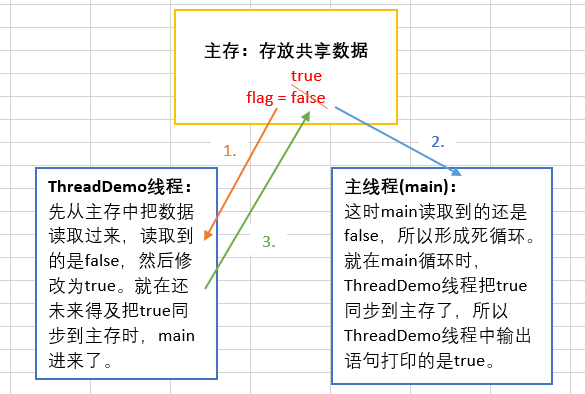

#[前言](https://www.jianshu.com/p/1f19835e05c0)
在Java中，线程部分是一个重点，本篇文章说的JUC也是关于线程的。JUC就是java.util .concurrent工具包的简称。
这是一个处理线程的工具包，JDK 1.5开始出现的。下面一起来看看它怎么使用。


# 一、volatile关键字与内存可见性
## 1、内存可见性：
```java
public class TestVolatile {
    public static void main(String[] args){ //这个线程是用来读取flag的值的
        ThreadDemo threadDemo = new ThreadDemo();
        Thread thread = new Thread(threadDemo);
        thread.start();
        while (true){
            if (threadDemo.isFlag()){
                System.out.println("主线程读取到的flag = " + threadDemo.isFlag());
                break;
            }
        }
    }
}

@Data
class ThreadDemo implements Runnable{ //这个线程是用来修改flag的值的
    public  boolean flag = false;
    @Override
    public void run() {
        try {
            Thread.sleep(200);
        } catch (InterruptedException e) {
            e.printStackTrace();
        }
        flag = true;
        System.out.println("ThreadDemo线程修改后的flag = " + isFlag());
    }
}
```
这段代码很简单，就是一个ThreadDemo类继承Runnable创建一个线程。它有一个成员变量flag为false，然后重写run方法，
在run方法里面将flag改为true，同时还有一条输出语句。然后就是main方法主线程去读取flag。如果flag为true，就会break掉while循环，
否则就是死循环。按道理，下面那个线程将flag改为true了，主线程读取到的应该也是true，循环应该会结束。看看运行结果：


从图中可以看到，该程序并没有结束，也就是死循环。说明主线程读取到的flag还是false，可是另一个线程明明将flag改为true了，
而且打印出来了，这是什么原因呢？这就是内存可见性问题。

- 内存可见性问题：当多个线程操作共享数据时，彼此不可见。

看下图理解上述代码：



要解决这个问题，可以加锁。如下：

```
while (true){
        synchronized (threadDemo){
            if (threadDemo.isFlag()){
                System.out.println("主线程读取到的flag = " + threadDemo.isFlag());
                break;
            }
        }
 }
```
加了锁，就可以让while循环每次都从主存中去读取数据，这样就能读取到true了。但是一加锁，每次只能有一个线程访问，当一个线程持有锁时，其他的就会阻塞，
效率就非常低了。不想加锁，又要解决内存可见性问题，那么就可以使用volatile关键字。

## 2、volatile关键字
用法：

volatile关键字：当多个线程操作共享数据时，可以保证内存中的数据可见。用这个关键字修饰共享数据，就会及时的把线程缓存中的数据刷新到主存中去，
也可以理解为，就是直接操作主存中的数据。所以在不使用锁的情况下，可以使用volatile。如下：
```java
public  volatile boolean flag = false;
```

这样就可以解决内存可见性问题了。

volatile和synchronized的区别：
- volatile不具备互斥性(当一个线程持有锁时，其他线程进不来，这就是互斥性)。
- volatile不具备原子性。

# 二、原子性

## 1、理解原子性

上面说到volatile不具备原子性，那么原子性到底是什么呢？先看如下代码：

```java
public class TestIcon {
    public static void main(String[] args){
        AtomicDemo atomicDemo = new AtomicDemo();
        for (int x = 0;x < 10; x++){
            new Thread(atomicDemo).start();
        }
    }
}

class AtomicDemo implements Runnable{
    private int i = 0;
    public int getI(){
        return i++;
    }
    @Override
    public void run() {
        try {
            Thread.sleep(200);
        } catch (InterruptedException e) {
            e.printStackTrace();
        }
        System.out.println(getI());
    }
}
```
这段代码就是在run方法里面让i++，然后启动十个线程去访问。看看结果：


可以发现，出现了重复数据。明显产生了多线程安全问题，或者说原子性问题。所谓原子性就是操作不可再细分，而i++操作分为读改写三步，如下

```java
    int temp = i;
    i = i+1;
    i = temp;
```
所以i++明显不是原子操作。上面10个线程进行i++时，内存图解如下：


看到这里，好像和上面的内存可见性问题一样。是不是加个volatile关键字就可以了呢？其实不是的，因为加了volatile，
只是相当于所有线程都是在主存中操作数据而已，但是不具备互斥性。比如两个线程同时读取主存中的0，然后又同时自增，同时写入主存，结果还是会出现重复数据。

## 2、原子变量

JDK 1.5之后，Java提供了原子变量，在java.util.concurrent.atomic包下。原子变量具备如下特点：

- 有volatile保证内存可见性。
- 用CAS算法保证原子性。

3、CAS算法：
CAS算法是计算机硬件对并发操作共享数据的支持，CAS包含3个操作数：

- 内存值V
- 预估值A
- 更新值B

当且仅当V==A时，才会把B的值赋给V，即V = B，否则不做任何操作。就上面的i++问题，CAS算法是这样处理的：首先V是主存中的值0，然后预估值A也是0，因为此时还没有任何操作，这时V=B，所以进行自增，同时把主存中的值变为1。如果第二个线程读取到主存中的还是0也没关系，因为此时预估值已经变成1，V不等于A，所以不进行任何操作。

4、使用原子变量改进i++问题：
原子变量用法和包装类差不多，如下：
```java
 //private int i = 0;
 AtomicInteger i = new AtomicInteger();
 public int getI(){
     return i.getAndIncrement();
 }
```
只改这两处即可。
# 三、锁分段机制

JDK 1.5之后，在java.util.concurrent包中提供了多种并发容器类来改进同步容器类的性能。其中最主要的就是ConcurrentHashMap。

## 1、ConcurrentHashMap
ConcurrentHashMap就是一个线程安全的hash表。我们知道HashMap是线程不安全的，Hash Table加了锁，是线程安全的，因此它效率低。
HashTable加锁就是将整个hash表锁起来，当有多个线程访问时，同一时间只能有一个线程访问，并行变成串行，因此效率低。所以JDK1.5后提供了ConcurrentHashMap，
它采用了锁分段机制。


如上图所示，ConcurrentHashMap默认分成了16个segment，每个Segment都对应一个Hash表，且都有独立的锁。所以这样就可以每个线程访问一个Segment，就可以并行访问了，
从而提高了效率。这就是锁分段。**但是**，java 8 又更新了，不再采用锁分段机制，也采用CAS算法了。

## 2、用法

java.util.concurrent包还提供了设计用于多线程上下文中的 Collection 实现： ConcurrentHashMap、ConcurrentSkipListMap、ConcurrentSkipListSet、CopyOnWriteArrayList 和 CopyOnWriteArraySet。
当期望许多线程访问一个给 定 collection 时，ConcurrentHashMap 通常优于同步的 HashMap， ConcurrentSkipListMap 通常优于同步的 TreeMap。
当期望的读数和遍历远远 大于列表的更新数时，CopyOnWriteArrayList 优于同步的 ArrayList。下面看看部分用法：
```java
public class TestConcurrent {
    public static void main(String[] args){
        ThreadDemo2 threadDemo2 = new ThreadDemo2();
           for (int i=0;i<10;i++){
               new Thread(threadDemo2).start();
           }
    }
}
//10个线程同时访问
class ThreadDemo2 implements Runnable{
    private static List<String> list = Collections.synchronizedList(new ArrayList<>());//普通做法
    static {
        list.add("aaa");
        list.add("bbb");
        list.add("ccc");
    }
    @Override
    public void run() {
        Iterator<String> iterator = list.iterator();
        while (iterator.hasNext()){
            System.out.println(iterator.next());//读
            list.add("ddd");//写
        }
    }
}
```
  10个线程并发访问这个集合，读取集合数据的同时再往集合中添加数据。运行这段代码会报错，并发修改异常。  


将创建集合方式改成：

```java
private static CopyOnWriteArrayList<String> list = new CopyOnWriteArrayList<>();
```
这样就不会有并发修改异常了。因为这个是写入并复制，每次生成新的，所以如果添加操作比较多的话，开销非常大，适合迭代操作比较多的时候使用。

# 四、闭锁
java.util.concurrent包中提供了多种并发容器类来改进同步容器的性能。ContDownLatch是一个同步辅助类，在完成某些运算时，只有其他所有线程的运算全部完成，
当前运算才继续执行，这就叫闭锁。看下面代码：
```java
public class TestCountDownLatch {
    public static void main(String[] args){
        LatchDemo ld = new LatchDemo();
        long start = System.currentTimeMillis();
        for (int i = 0;i<10;i++){
            new Thread(ld).start();
        }
        long end = System.currentTimeMillis();
        System.out.println("耗费时间为："+(end - start)+"秒");
    }
}

class LatchDemo implements Runnable{
    private CountDownLatch latch;
    public LatchDemo(){
    }
    @Override
    public void run() {
        for (int i = 0;i<5000;i++){
            if (i % 2 == 0){//50000以内的偶数
                System.out.println(i);
            }
        }
    }
}
```
这段代码就是10个线程同时去输出5000以内的偶数，然后在主线程那里计算执行时间。其实这是计算不了那10个线程的执行时间的，因为主线程与这10个线程也是同时执行的，可能那10个线程才执行到一半，主线程就已经输出“耗费时间为x秒”这句话了。所有要想计算这10个线程执行的时间，就得让主线程先等待，等10个分线程都执行完了才能执行主线程。这就要用到闭锁。看如何使用：

```java
public class TestCountDownLatch {
    public static void main(String[] args) {
        final CountDownLatch latch = new CountDownLatch(10);//有多少个线程这个参数就是几
        LatchDemo ld = new LatchDemo(latch);
        long start = System.currentTimeMillis();
        for (int i = 0; i < 10; i++) {
            new Thread(ld).start();
        }
        try {
            latch.await();//这10个线程执行完之前先等待
        } catch (InterruptedException e) {
        }
        long end = System.currentTimeMillis();
        System.out.println("耗费时间为：" + (end - start));
    }
}

class LatchDemo implements Runnable {
    private CountDownLatch latch;
    public LatchDemo(CountDownLatch latch) {
        this.latch = latch;
    }
    @Override
    public void run() {
        synchronized (this) {
            try {
                for (int i = 0; i < 50000; i++) {
                    if (i % 2 == 0) {//50000以内的偶数
                        System.out.println(i);
                    }
                }
            } finally {
                latch.countDown();//每执行完一个就递减一个
            }
        }
    }
}
```
如上代码，主要就是用latch.countDown()和latch.await()实现闭锁，详细请看上面注释即可。

# 五、创建线程的方式 --- 实现Callable接口
直接看代码：

```java
public class TestCallable {
    public static void main(String[] args){
        CallableDemo callableDemo = new CallableDemo();
        //执行callable方式，需要FutureTask实现类的支持，用来接收运算结果
        FutureTask<Integer> result = new FutureTask<>(callableDemo);
        new Thread(result).start();
        //接收线程运算结果
        try {
            Integer sum = result.get();//当上面的线程执行完后，才会打印结果。跟闭锁一样。所有futureTask也可以用于闭锁
            System.out.println(sum);
        } catch (Exception e) {
            e.printStackTrace();
        }
    }
}

class CallableDemo implements Callable<Integer>{
    @Override
    public Integer call() throws Exception {
       int sum = 0;
       for (int i = 0;i<=100;i++){
           sum += i;
       }
       return sum;
    }
}
```

现在Callable接口和实现Runable接口的区别就是，Callable带泛型，其call方法有返回值。使用的时候，需要用FutureTask来接收返回值。而且它也要等到线程执行完调用get方法才会执行，也可以用于闭锁操作。

# 六、Lock同步锁
在JDK1.5之前，解决多线程安全问题有两种方式(sychronized隐式锁)：

- 同步代码块
- 同步方法
在JDK1.5之后，出现了更加灵活的方式(Lock显式锁)：

- 同步锁
Lock需要通过lock()方法上锁，通过unlock()方法释放锁。为了保证锁能释放，所有unlock方法一般放在finally中去执行。

再来看一下卖票案例：

```java
public class TestLock {
    public static void main(String[] args) {
        Ticket td = new Ticket();
        new Thread(td, "窗口1").start();
        new Thread(td, "窗口2").start();
        new Thread(td, "窗口3").start();
    }
}

class Ticket implements Runnable {
    private int ticket = 100;
    @Override
    public void run() {
        while (true) {
            if (ticket > 0) {
                try {
                    Thread.sleep(200);
                } catch (Exception e) {
                }
                System.out.println(Thread.currentThread().getName() + "完成售票，余票为：" + (--ticket));
            }
        }
    }
}
```
多个线程同时操作共享数据ticket，所以会出现线程安全问题。会出现同一张票卖了好几次或者票数为负数的情况。以前用同步代码块和同步方法解决，现在看看用同步锁怎么解决。

```java
class Ticket implements Runnable {
    private Lock lock = new ReentrantLock();//创建lock锁
    private int ticket = 100;
    @Override
    public void run() {
        while (true) {
            lock.lock();//上锁
            try {
                if (ticket > 0) {
                    try {
                        Thread.sleep(200);
                    } catch (Exception e) {
                    }
                    System.out.println(Thread.currentThread().getName() + "完成售票，余票为：" + (--ticket));
                }
            }finally {
                lock.unlock();//释放锁
            }

        }
    }
}
```
直接创建lock对象，然后用lock()方法上锁，最后用unlock()方法释放锁即可。

Thread类构造方法


# 七、等待唤醒机制
## 1、虚假唤醒问题：
生产消费模式是等待唤醒机制的一个经典案例，看下面的代码：

```java
public class TestProductorAndconsumer {
    public static void main(String[] args){
           Clerk clerk = new Clerk();
           Productor productor = new Productor(clerk);
           Consumer consumer = new Consumer(clerk);
           new Thread(productor,"生产者A").start();
           new Thread(consumer,"消费者B").start();
    }
}
//店员
class Clerk{
    private int product = 0;//共享数据
    public synchronized void get(){ //进货
        if(product >= 10){
            System.out.println("产品已满");
        }else {
            System.out.println(Thread.currentThread().getName()+":"+ (++product));
        }
    }
    public synchronized void sell(){//卖货
        if (product <= 0){
            System.out.println("缺货");
        }else {
            System.out.println(Thread.currentThread().getName()+":"+ (--product));
        }
    }
}
//生产者
class Productor implements Runnable{
    private Clerk clerk;
    public Productor(Clerk clerk){
        this.clerk = clerk;
    }
    @Override
    public void run() {
        for (int i = 0;i<20;i++){
            clerk.get();
        }
    }
}
//消费者
class Consumer implements Runnable{
    private Clerk clerk;
    public Consumer(Clerk clerk){
        this.clerk = clerk;
    }
    @Override
    public void run() {
        for (int i = 0;i<20;i++){
            clerk.sell();
        }
    }
}
```

这就是生产消费模式的案例，这里没有使用等待唤醒机制，运行结果就是即使是缺货状态，它也会不断的去消费，也会一直打印“缺货”，即使是产品已满状态，也会不断地进货。用等待唤醒机制改进：
```java
//店员
class Clerk{
    private int product = 0;//共享数据
    public synchronized void get(){ //进货
        if(product >= 10){
            System.out.println("产品已满");
            try {
                this.wait();//满了就等待
            } catch (InterruptedException e) {
                e.printStackTrace();
            }
        }else {
            System.out.println(Thread.currentThread().getName()+":"+ (++product));
            this.notifyAll();//没满就可以进货
        }
    }
    public synchronized void sell(){//卖货
        if (product <= 0){
            System.out.println("缺货");
            try {
                this.wait();//缺货就等待
            } catch (InterruptedException e) {
                e.printStackTrace();
            }
        }else {
            System.out.println(Thread.currentThread().getName()+":"+ (--product));
            this.notifyAll();//不缺货就可以卖
        }
    }
}
```

这样就不会出现上述问题了。没有的时候就生产，生产满了就通知消费，消费完了再通知生产。但是这样还是有点问题，将上述代码做如下改动：
```java
if(product >= 1){ //把原来的10改成1
            System.out.println("产品已满");
         ......
public void run() {
        try {
            Thread.sleep(200);//睡0.2秒
        } catch (InterruptedException e) {
            e.printStackTrace();
        }
        for (int i = 0;i<20;i++){
            clerk.sell();
        }
}
```
就做这两处修改，再次运行，发现虽然结果没问题，但是程序却一直没停下来。出现这种情况是因为有一个线程在等待，而另一个线程没有执行机会了，唤醒不了这个等待的线程了，所以程序就无法结束。解决办法就是把get和sell方法里面的else去掉，不要用else包起来。但是，即使这样，如果再多加两个线程，就会出现负数了。

```java
new Thread(productor, "生产者C").start();
new Thread(consumer, "消费者D").start();
```
运行结果：


一个消费者线程抢到执行权，发现product是0，就等待，这个时候，另一个消费者又抢到了执行权，product是0，还是等待，此时两个消费者线程在同一处等待。然后当生产者生产了一个product后，就会唤醒两个消费者，发现product是1，同时消费，结果就出现了0和-1。这就是虚假唤醒。解决办法就是把if判断改成while。如下：

```java
 public synchronized void get() { //进货
        while (product >= 1) {
            System.out.println("产品已满");
            try {
                this.wait();//满了就等待
            } catch (InterruptedException e) {
                e.printStackTrace();
            }
        }
            System.out.println(Thread.currentThread().getName() + ":" + (++product));
            this.notifyAll();//没满就可以进货
    }
    public synchronized void sell() {//卖货
        while (product <= 0) {//为了避免虚假唤醒问题，wait方法应该总是在循环中使用
            System.out.println("缺货");
            try {
                this.wait();//缺货就等待
            } catch (InterruptedException e) {
                e.printStackTrace();
            }
        }
            System.out.println(Thread.currentThread().getName() + ":" + (--product));
            this.notifyAll();//不缺货就可以卖
    }
```

只需要把if改成while，每次都再去判断一下，就可以了。

## 2、用Lock锁实现等待唤醒

```java
class Clerk {
    private int product = 0;//共享数据
    private Lock lock = new ReentrantLock();//创建锁对象
    private Condition condition = lock.newCondition();//获取condition实例
    public  void get() { //进货
        lock.lock();//上锁
        try {
            while (product >= 1) {
                System.out.println("产品已满");
                try {
                    condition.await();//满了就等待
                } catch (InterruptedException e) {
                }
            }
            System.out.println(Thread.currentThread().getName() + ":" + (++product));
            condition.signalAll();//没满就可以进货
        }finally {
            lock.unlock();//释放锁
        }
    }

    public  void sell() {//卖货
        lock.lock();//上锁
        try {
            while (product <= 0) {
                System.out.println("缺货");
                try {
                    condition.await();//缺货就等待
                } catch (InterruptedException e) {
                    e.printStackTrace();
                }
            }
            System.out.println(Thread.currentThread().getName() + ":" + (--product));
            condition.signalAll();//不缺货就可以卖
        }finally {
            lock.unlock();//释放锁
        }
    }
}
```

使用lock同步锁，就不需要sychronized关键字了，需要创建lock对象和condition实例。condition的await()方法、signal()方法和signalAll()方法分别与wait()方法、notify()方法和notifyAll()方法对应

## 3、线程按序交替：
   首先来看一道题：
```html
    编写一个程序，开启 3 个线程，这三个线程的 ID 分别为 A、B、C，
    每个线程将自己的 ID 在屏幕上打印 10 遍，要求输出的结果必须按顺序显示。
    如：ABCABCABC…… 依次递归
```
分析：
```html
    线程本来是抢占式进行的，要按序交替，所以必须实现线程通信，
    那就要用到等待唤醒。可以使用同步方法，也可以用同步锁。
```
编码实现：
```java
public class TestLoopPrint {
    public static void main(String[] args) {
        AlternationDemo ad = new AlternationDemo();
        new Thread(new Runnable() {
            @Override
            public void run() {
                for (int i = 0; i < 10; i++) {
                    ad.loopA();
                }
            }
        }, "A").start();
        new Thread(new Runnable() {
            @Override
            public void run() {
                for (int i = 0; i < 10; i++) {
                    ad.loopB();
                }
            }
        }, "B").start();
        new Thread(new Runnable() {
            @Override
            public void run() {
                for (int i = 0; i < 10; i++) {
                    ad.loopC();
                }
            }
        }, "C").start();
    }
}

class AlternationDemo {
    private int number = 1;//当前正在执行的线程的标记
    private Lock lock = new ReentrantLock();
    Condition condition1 = lock.newCondition();
    Condition condition2 = lock.newCondition();
    Condition condition3 = lock.newCondition();

    public void loopA() {
        lock.lock();
        try {
            if (number != 1) { //判断
                condition1.await();
            }
            System.out.println(Thread.currentThread().getName());//打印
            number = 2;
            condition2.signal();
        } catch (Exception e) {
        } finally {
            lock.unlock();
        }
    }

    public void loopB() {
        lock.lock();
        try {
            if (number != 2) { //判断
                condition2.await();
            }
            System.out.println(Thread.currentThread().getName());//打印
            number = 3;
            condition3.signal();
        } catch (Exception e) {
        } finally {
            lock.unlock();
        }
    }

    public void loopC() {
        lock.lock();
        try {
            if (number != 3) { //判断
                condition3.await();
            }
            System.out.println(Thread.currentThread().getName());//打印
            number = 1;
            condition1.signal();
        } catch (Exception e) {
        } finally {
            lock.unlock();
        }
    }
}
```
以上编码就满足需求。创建三个线程，分别调用loopA、loopB和loopC方法，这三个线程使用condition进行通信。

# 八、ReadWriterLock读写锁
我们在读数据的时候，可以多个线程同时读，不会出现问题，但是写数据的时候，如果多个线程同时写数据，那么到底是写入哪个线程的数据呢？所以，如果有两个线程，写写/读写需要互斥，读读不需要互斥。这个时候可以用读写锁。看例子：

```java
public class TestReadWriterLock {
    public static void main(String[] args){
           ReadWriterLockDemo rw = new ReadWriterLockDemo();
           new Thread(new Runnable() {//一个线程写
               @Override
               public void run() {
                   rw.set((int)Math.random()*101);
               }
           },"write:").start();
           for (int i = 0;i<100;i++){//100个线程读
               Runnable runnable = () -> rw.get();
               Thread thread = new Thread(runnable);
               thread.start();
           }
    }
}

class ReadWriterLockDemo{
    private int number = 0;
    private ReadWriteLock readWriteLock = new ReentrantReadWriteLock();
    //读(可以多个线程同时操作)
    public void get(){
        readWriteLock.readLock().lock();//上锁
        try {
            System.out.println(Thread.currentThread().getName()+":"+number);
        }finally {
            readWriteLock.readLock().unlock();//释放锁
        }
    }
    //写(一次只能有一个线程操作)
    public void set(int number){
        readWriteLock.writeLock().lock();
        try {
            System.out.println(Thread.currentThread().getName());
            this.number = number;
        }finally {
            readWriteLock.writeLock().unlock();
        }
    }
}
```
这个就是读写锁的用法。上面的代码实现了一个线程写，一百个线程同时读的操作。

# 九、线程池
我们使用线程时，需要new一个，用完了又要销毁，这样频繁的创建销毁也很耗资源，所以就提供了线程池。道理和连接池差不多，连接池是为了避免频繁的创建和释放连接，所以在连接池中就有一定数量的连接，要用时从连接池拿出，用完归还给连接池。线程池也一样。线程池中有一个线程队列，里面保存着所有等待状态的线程。下面来看一下用法：

```java
public class TestThreadPool {
    public static void main(String[] args) {
        ThreadPoolDemo tp = new ThreadPoolDemo();
        //1.创建线程池
        ExecutorService pool = Executors.newFixedThreadPool(5);
        //2.为线程池中的线程分配任务
        pool.submit(tp);
        //3.关闭线程池
        pool.shutdown();
    }
}

class ThreadPoolDemo implements Runnable {
    private int i = 0;
    @Override
    public void run() {
        while (i < 100) {
            System.out.println(Thread.currentThread().getName() + ":" + (i++));
        }
    }
}
```
线程池用法很简单，分为三步。首先用工具类Executors创建线程池，然后给线程池分配任务，最后关闭线程池就行了。


