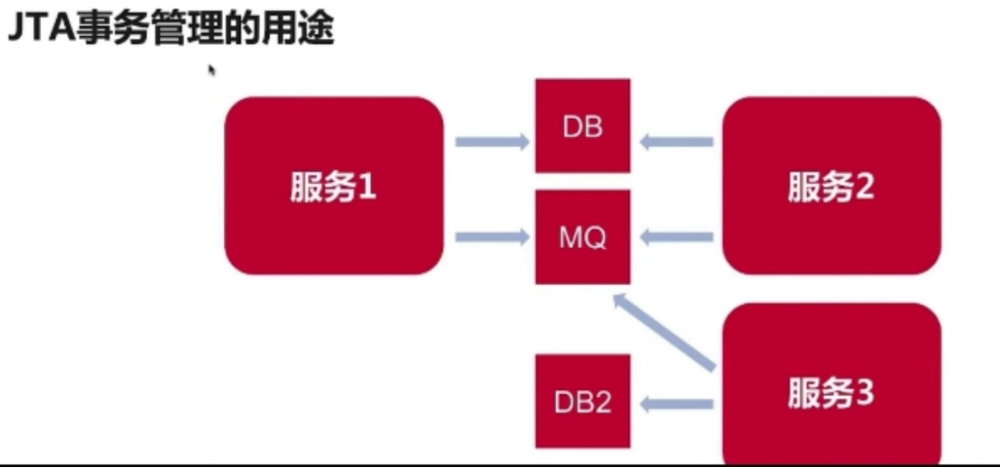

# spring-trans-jta

## 介绍
解决一个服务访问多个数据源的事务一致性问题

Spring JTA实现多数据源(DB,MQ)的事务管理

## 安装教程

H2数据库:运行后访问:http://localhost:8888/h2  
ActiveMQ:需要自行安装,  http://archive.apache.org/dist/activemq/5.15.3/apache-activemq-5.15.3-bin.zip

## 软件架构
mq连接:ConnectionFactory  
消息模板:JmsTemplate  
监听器:JmsListenerContainerFactory  
事务:PlatformTransactionManager/JmsTransactionManager  
db数据持久层:JPA

## 事务

### 事务的原则
事务是什么:是以一种可靠,一致的方式,访问和操作数据库中数据的程序单元
**事务的原则:**
- A原子性
要么都完成,要么都完不成
- C一致性
事务完成后.状态的改变是一致的,结果是完整的,和原子性有一点关联
- I隔离性
不同事务操作同样数据的时候,它们之间的隔离性,比如一个事务的修改没有提交,在另一个事务能不能看到别人没有提交的数据.看到会怎么样
- D持久性
事务提交以后,这个数据操作的结果才会进入数据库,才会永久保存,如果因为故障,事务没有提交,这个数据的修改就不会出现在数据库里

For update实现数据隔离:

Select * from 表 for update  会把查询结果加上锁,事务对这个表进行加锁,只有事务提交了,其他的事务才能执行查询,实现隔离
Mysql有一个隔离机制Serializable是默认对所有的表进行锁,和for update一样的

### Spring事务
spring-tx-xxxx.RELEASE.jar下的PlatformTransactionManager

PlatformTransactionManager常见实现
- DataSourceTransactionManager:直接使用jdbc,比较底层,常见不常用
- JpaTransactionManager:使用jpa,自行拓展JpaRepository
- JmsTransactionManager:如果各种消息中间件,使用这个进行事务管理
- JtaTransactionManager:独立的事务管理器,JTA事务管理器可以管理多个数据资源(DB,MQ)
### 非spring的JTA(Java Transaction Api)
通过spring事务接口,调用外部管理器,
在spring容器里创建一个JTA管理器,比如atomikos的jta实现,atomikos是java的库.通过这个库可以在spring容器里启动一个atomikos的jta事务管理器的一个线程,这个线程会在线程下面进行独立的事务管理

### XA规范
XA是xopen组织提出的分布式事务的规范,该规范定义了一个全局的事务管理接口Transaction Manager和一个XA Resource (相当于对数据资源封装的一个接口),
还有一个两阶段提交的机制
XA规范规范的Java实现是jta.
JTA的三个接口:TransactionManager,XAResource,XID

### 2阶段提交(2PC提交)

二阶段提交协议是将事务的提交过程分成提交事务请求和执行事务提交两个阶段进行处理。
当在一个jta事务里面使用两个数据库的时候进行两阶段提交,第一阶段先提交,等所有数据提交返回没有问题然后在进行第二阶段提交第二阶段提交完成后,数据才真正写到数据库,持久化,事务完成,当第一阶段返回错误,第二阶段不会提交,直接rollback

- 阶段1：提交事物请求

事务询问：协调者向所有的参与者发送事物内容，询问是否可以执行事务提交操作，并开始等待各参与者的响应

执行事务：各参与者节点执行事物操作，并将Undo和Redo信息记入事务日志中

如果参与者成功执事务操作，就反馈给协调者Yes响应，表示事物可以执行，如果没有成功执行事务，就反馈给协调者No响应，表示事务不可以执行

二阶段提交一些的阶段一夜被称为投票阶段，即各参与者投票票表明是否可以继续执行接下去的事物提交操作

- 阶段二：执行事物提交

假如协调者从所有的参与者或得反馈都是Yes响应，那马就会执行事务提交。

发送提交请求：协调者向所有参与者节点发出Commit请求

事务提交：参与者接受到Commit请求后，会正式执行事物提交操作，并在完成提交之后放弃整个事务执行期间占用的事务资源

反馈事务提交结果:参与者在完成事物提交之后，向协调者发送ACK消息

完成事务：协调者接收到所有参与者反馈的ACK消息后，完成事物

- 中断事务

假如任何一个参与者向协调者反馈了No响应，或者在等待超市之后，协调者尚无法接收到所有参与者的反馈响应，那么就中断事物。

发送回滚请求：协调者向搜优参与者节点发出Rollback请求

事物回滚：参与者接收到Rollback请求后，会利用其在阶段一种记录的Undo信息执行事物回滚操作，并在完成回滚之后释放事务执行期间占用的资源。

反馈事务回滚结果：参与则在完成事务回滚之后，向协调者发送ACK消息

中断事务：协调者接收到所有参与者反馈的ACk消息后，完成事务中断、

- 优缺点

原理简单，实现方便

缺点是同步阻塞，单点问题，脑裂，保守

### 3PC提交
三阶段提，也叫三阶段提交协议，是二阶段提交（2PC）的改进版本。

与两阶段提交不同的是，三阶段提交有两个改动点。引入超时机制。同时在协调者和参与者中都引入超时机制。在第一阶段和第二阶段中插入一个准备阶段。保证了在最后提交阶段之前各参与节点的状态是一致的。

阶段提交就有CanCommit、PreCommit、DoCommit三个阶段。

JTA事务管理的弊端

两阶段提交,
事务时间太长,锁数据的时间太长,
低性能,低吞吐量,

不使用JTA实现多数据源的事务管理

Spring事务同步机制
多个数据源上实现近似事务一致性
高性能高吞吐量

## 微服务的最大挑战
- 1.数据的并发访问,修改
- 2.不同请求之间的数据隔离
- 3.多个服务共同完成一个业务请求,保证都完成或失败
- 4.发生异常时的数据回滚

### 分布式系统需要考虑的问题
- 服务拆分:一个服务一个功能
- 数据拆分:一个服务一个数据库或多个数据库
- 计算拆分:对于一个请求,如果多个步骤.多个步骤都是同步完成或有些步骤是异步完成,对于操作我们是批量执行或者依次执行或者调度执行
- 服务状态以及异常处理:服务状态在服务注册中心是怎么维护的,出错一次假设服务不可用,是调用其他服务还是重试几次,
事务最终一致性是允许出错,但是可以通过其他的方式处理出错的异常达到数据的最终一致性异常处理是怎么处理的,是简单的重试,是重试后还是出错就抛弃或者把出错信息放在某个出错消息队列里,
通过定时任务调用检测数据库各种异常的状态等

### 分布式事务
分布式事务是指事务的参与者，支持事务的服务器，资源服务器分别位于分布式系统的不同节点之上，通常一个分布式事物中会涉及到对多个数据源或业务系统的操作。

典型的分布式事务场景：跨银行转操作就涉及调用两个异地银行服务

#### CAP原则
- C一致性:
数据在多个副本之间是否能够保持一致的特性.
- A可用性:
是指系统提供的服务必须一致处于可用状态，对于每一个用户的请求总是在有限的时间内返回结果，超过时间就认为系统是不可用的.
- P分区容错性:
分布式系统在遇到任何网络分区故障的时候，仍然需要能够保证对外提供满足一致性和可用性的服务，除非整个网络环境都发生故障.

一个分布式系统不可能同时满足一致性，可用性和分区容错性这个三个基本需求，最多只能同时满足其中两项

#### CAP定理的应用
放弃P：如果希望能够避免系统出现分区容错性问题，一种较为简单的做法就是将所有的数据(或者是与事物先相关的数据)都放在一个分布式节点上，这样索然无法保证100%系统不会出错，但至少不会碰到由于网络分区带来的负面影响
放弃A:其做法是一旦系统遇到网络分区或其他故障时，那么受到影响的服务需要等待一定的时间，因此等待期间系统无法对外提供正常的服务，即不可用
放弃C:这里说的放弃一致性，并不是完全不需要数据一致性，是指放弃数据的强一致性，保留数据的最终一致性。

一致性又分为强一致性(困难),弱一致性(复杂),最终一致性(弱一致性基础上允许出错,出错时不要求完全的一致性实现回滚等操作,而是通过超时重试的操作尝试重新执行或者定时检测出错的业务方法做一些数据的回滚操作)

#### BASE理论
BASE是基本可用，软状态，最终一致性。是对CAP中一致性和可用性权衡的结果，是基于CAP定理演化而来的，核心思想是即使无法做到强一致性，
但每个应用都可以根据自身的业务特定，采用适当的方式来使系统达到最终一致性
- Basically  Available (基本可用)
- Soft state(软状态)
- Eventually consistent(最终一致性)

#### 分布式事务实现模式与技术
##### 实现模式
消息驱动模式(Message Driven)

使用mq的消息把分布式系统多个服务之间这个调用串起来

TCC模式(Try-Confirm-Cancel)

根据事务的方法实现的,在实现事务的时候,步骤是先去执行操作然后再commit如果在过程中出现错误做一个rollback操作,这三个操作过程就是try,confirm,cancel,这种模式适应于服务间调用这种情况

##### 幂等性
(唯一UUID,分布式锁)
幂等操作:任意多次执行所产生的影响,与一次执行的影响相同
方法的幂等性:使用同样的参数调用方法多次,与调用一次结果相同
接口的幂等性:接口被重复调用,结果一致,

微服务接口的幂等性:经常需要重试实现分布式事务的最终一致性,GET方法不会对系统产生副作用(不会更改数据,只是读数据),具有幂等性,POST,PUT,DELETE方法的实现需要满足幂等性

参考:https://blog.csdn.net/u010391342/article/details/100404588