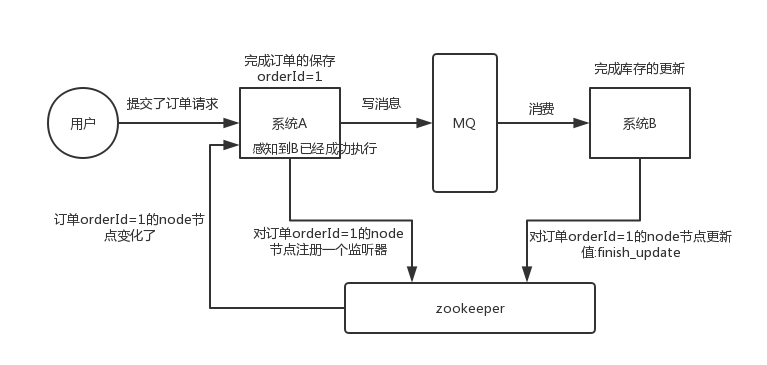

# Zookeeper

## 介绍
Zookeeper相关学习

Windows环境下安装:https://blog.csdn.net/qq877507054/article/details/110739854

启动后访问:http://localhost:8060/swagger-ui.html


# ZooKeeper入门
## 一.ZooKeeper是什么
ZooKeeper由雅虎研究院开发，是Google Chubby的开源实现，后来托管到Apache，于2010年11月正式成为Apache的顶级项目。
ZooKeeper是一个经典的分布式数据一致性解决方案，致力于为分布式应用提供一个高性能、高可用，且具有严格顺序访问控制能力的分布式协调服务。
分布式应用程序可以基于ZooKeeper实现数据
- 发布与订阅、
- 负载均衡、
- 命名服务、
- 分布式协调与通知、
- 集群管理、
- Leader选举、
- 分布式锁、
- 分布式队列等功能。


## 二.ZooKeeper目标
ZooKeeper致力于为分布式应用提供一个高性能、高可用，且具有严格顺序访问控制能力的分布式协调服务

### 2.1 高性能
ZooKeeper将全量数据存储在内存中，并直接服务于客户端的所有非事务请求，尤其适用于以读为主的应用场景

### 2.2 高可用
ZooKeeper一般以集群的方式对外提供服务，一般3 ~ 5台机器就可以组成一个可用的Zookeeper集群了，每台机器都会在内存中维护当前的服务器状态，并且每台机器之间都相互保持着通信。只要集群中超过一般的机器都能够正常工作，那么整个集群就能够正常对外服务

### 2.3 严格顺序访问
对于来自客户端的每个更新请求，ZooKeeper都会分配一个全局唯一的递增编号，这个编号反映了所有事务操作的先后顺序


## 三. ZooKeeper五大特性
ZooKeeper一般以集群的方式对外提供服务，一个集群包含多个节点，每个节点对应一台ZooKeeper服务器，所有的节点共同对外提供服务，整个集群环境对分布式数据一致性提供了全面的支持，具体包括以下五大特性：

### 3.1 顺序一致性
从同一个客户端发起的请求，最终将会严格按照其发送顺序进入ZooKeeper中

### 3.2 原子性
所有请求的响应结果在整个分布式集群环境中具备原子性，即要么整个集群中所有机器都成功的处理了某个请求，要么就都没有处理，绝对不会出现集群中一部分机器处理了某一个请求，而另一部分机器却没有处理的情况

### 3.3 单一性
无论客户端连接到ZooKeeper集群中哪个服务器，每个客户端所看到的服务端模型都是一致的，不可能出现两种不同的数据状态，因为ZooKeeper集群中每台服务器之间会进行数据同步

### 3.4 可靠性
一旦服务端数据的状态发送了变化，就会立即存储起来，除非此时有另一个请求对其进行了变更，否则数据一定是可靠的

### 3.5 实时性
当某个请求被成功处理后，ZooKeeper仅仅保证在一定的时间段内，客户端最终一定能从服务端上读取到最新的数据状态，即ZooKeeper保证数据的最终一致性


## 四.ZooKeeper集群角色
在分布式系统中，集群中每台机器都有自己的角色，ZooKeeper没有沿用传统的Master/Slave模式（主备模式），而是引入了Leader、Follower和Observer三种角色

### 4.1 Leader
集群通过一个Leader选举过程从所有的机器中选举一台机器作为”Leader”，Leader能为客户端提供读和写服务,Leader在服务启动时被选举。
Leader服务器是整个集群工作机制的核心，主要工作：

事务请求的唯一调度者和处理者，保证集群事务处理的顺序性
集群内部各服务器的调度者

### 4.2 Follower
顾名思义，Follower是追随者，主要工作：

参与Leader选举投票
处理客户端非事务请求 - 即读服务
转发事务请求给Leader服务器
参与事务请求Proposal的投票
### 4.3 Observer
Observer是ZooKeeper自3.3.0版本开始引入的一个全新的服务器角色，充当一个观察者角色，工作原理和Follower基本是一致的，和Follower唯一的区别是Observer不参与任何形式的投票

- 处理客户端非事务请求 - 即读服务
- 转发事务请求给Leader服务器
- 不参与Leader选举投票
- 参与事务请求Proposal的投票
所以Observer可以在不影响写性能的情况下提升集群的读性能

以上是服务端的角色


## 五.原子广播协议 - Zab
ZooKeeper并非采用经典的分布式一致性协议 - Paxos，而是参考了Paxos设计了一种更加轻量级的支持崩溃可恢复的原子广播协议-Zab（ZooKeeper Atomic Broadcast）。
ZAB协议分为两个阶段 - Leader Election（领导选举）和Atomic Broadcast（原子广播）

### 5.1 领导选举 - Leader Election
当集群启动时，会选举一台节点为Leader，而其他节点为Follower，当Leader节点出现网络中断、崩溃退出与重启等异常情况，ZAB会进入恢复模式并选举产生新的Leader服务器，当集群中已有过半机器与该Leader服务器完成数据状态同步，退出恢复模式,
所谓的状态同步是指数据同步，用来保证集群中存在过半的机器能够和Leader服务器的数据状态保持一致。

### 5.2 原子广播 - Atomic Broadcast
当领导选举完成后，就进入原子广播阶段。此时集群中已存在一个Leader服务器在进行消息广播，当一台同样遵循ZAB协议的服务器启动后加入到集群中，新加的服务器会自动进入数据恢复阶段


## 六.事务请求
在ZooKeeper中，事务是指能够改变ZooKeeper服务器状态的请求，一般指创建节点、更新数据、删除节点以及创建会话操作

### 6.1 事务转发
为了保证事务请求被顺序执行，从而确保ZooKeeper集群的数据一致性，所有的事务请求必须由Leader服务器处理，ZooKeeper实现了非常特别的事务请求转发机制：
所有非Leader服务器如果接收到来自客户端的事务请求，必须将其转发给Leader服务器来处理

### 6.2 事务ID - ZXID
在分布式系统中，事务请求可能存在依赖关系，如变更C需要依赖变更A和变更B，这样就要求ZAB协议能够保证如果一个状态变更成功被处理了，那么其所有依赖的状态变更都应该已经提前被处理掉了。
在ZooKeeper中对每一个事务请求，都会为其分配一个全局唯一的事务ID，使用ZXID表示，通常是一个64位的数字。每一个ZXID对应一次事务，从这些ZXID可以间接识别出ZooKeeper处理这些事务请求的全局顺序


## 七.数据节点 - ZNode
ZooKeeper内部拥有一个树状的内存模型，类似文件系统，只是在ZooKeeper中将这些目录与文件系统统称为ZNode，ZNode是ZooKeeper中数据的最小单元，每个ZNode上可以保存数据，还可以挂载子节点，因此构成了一个层次化的命名空间

### 7.1 节点路径
ZooKeeper中使用斜杠（/）分割的路径表示ZNode路径，斜杠（/）表示根节点


### 7.2 节点特性
在ZooKeeper中，每个数据节点ZNode都是有生命周期的，其生命周期的长短取决于ZNode的节点类型


### 7.3 权限控制 - ACL
为了有效保障ZooKeeper中数据的安全，避免因误操作而带来数据随意变更导致分布式系统异常，ZooKeeper提供了一套完善的ACL（Access Contro List）权限控制机制来保障数据的安全。
可以从三个方面理解ACL机制，分别是：权限模式（Scheme）、授权对象（ID）和权限（Permission），通常使用”scheme:id:permission”来标识一个有效的ACL信息


### 7.4 节点状态信息
每个数据节点ZNode除了存储数据内容外，还存储了数据节点本身的一些状态信息


### 7.5 节点版本
ZooKeeper为数据节点引入版本的概念，对个数据节点都具有三种类型的版本信息，对数据节点的任何更新操作都会引起版本号的变化


在分布式系统中，在运行过程中往往需要保证数据访问的排他性。Java并发中是实现了对CAS的指令支持，即对于值V，每次更新前都会比对其值是否是预期值A，只有符合预期，才会将V原子化的更新到新值B
而ZooKeeper每个节点都有数据版本的概念，在调用更新操作的时候，先从请求中获取当前请求的版本version，同时获取服务器上该数据最新版本currentVersion，如果无法匹配，就无法更新成功，这样可以有效避免一些分布式更新的并发问题


## 八. Watcher - 数据变更的通知
在ZooKeeper中，引入Watcher机制来实现分布式数据的发布/订阅功能。ZooKeeper允许客户端向服务器注册一个Watcher监听，当服务器的一些指定事件触发了这个Watcher，那么就会向指定客户端发送一个事件通知来实现分布式的通知功能

Watcher机制为以下三个过程：

### 8.1 客户端注册Watcher
在创建一个ZooKeeper客户端对象实例时，可以向构造方法中传入一个Watcher，这个Watcher将作为整个ZooKeeper会话期间的默认Watcher，一致保存在客户端，并向ZooKeeper服务器注册Watcher
客户端并不会把真实的Watcher对象传递到服务器，仅仅只是在客户端请求中使用boolean类型属性进行标记，降低网络开销和服务器内存开销

### 8.2 服务端处理Watcher
服务端执行数据变更，当Watcher监听的对应数据节点的数据内容发生变更，如果找到对应的Watcher，会将其提取出来，同时从管理中将其删除（说明Watcher在服务端是一次性的，即触发一次就失效了），触发Watcher，向客户端发送通知

### 8.3 客户端回调Watcher
客户端获取通知，识别出事件类型，从相应的Watcher存储中去除对应的Watcher（说明客户端也是一次性的，即一旦触发就会失效）

### 8.4 总结
一致性：无论是客户端还是服务器，一旦一个Watcher被处罚，ZooKeeper都会将其从相应的存储中移除，因此开发人员在Watcher使用上要反复注册，这样可以有效减轻服务器压力
客户端串行执行：客户端Watcher回调的过程是一个串行同步的过程，这保证了顺序
轻量：客户端并不会把真实的Watcher对象传递到服务器，仅仅只是在客户端请求中使用boolean类型属性进行标记，降低网络开销和服务器内存开销


## 九. Session - 会话
Session是指客户端连接 - 客户端和服务器之间的一个TCP长连接

### 9.1 会话状态
会话在整个生命周期中，会在不同的会话转态之间进行切换


### 9.2 Session属性
Session是ZooKeeper中的会话实体，代表了一个客户端会话，其包含4个属性：


### 9.3 心跳检测
为了保证客户端会话的有效性，客户端会在会话超时时间范围内向服务器发送PING请求来保持会话的有效性，即心跳检测。
服务器接收到客户端的这个心跳检测，就会重新激活对应的客户端会话

### 9.4 会话清理
服务器的超级检查线程会在指定时间点进行检查，整理出一些已经过期的会话后，就要开始进行会话清理了：

关闭会话
清理相关的临时节点
### 9.5 重连
当客户端和服务器之间网络连接断开，客户端会自动进行反复的重连，直到最终成功连接上ZooKeeper集群中的一台机器

在会话超时时间内重新连接上，被视为重连成功
在会话超时时间外重新连接上，此时服务器已经进行了会话清理，但客户端不知道会话已经失效，重新连接服务器会告诉客户端会话已失效，被视为非法会话
参考
《从Paxos到Zookeeper 分布式一致性原理与实践》
《轻量级微服务架构（上册）》


### Zookeeper集群安装
    wget http://www.apache.org/dist//zookeeper/zookeeper-3.3.3/zookeeper-3.3.3.tar.gz
    tar zxvf zookeeper-3.3.3.tar.gz
    cd zookeeper-3.3.3
    cp conf/zoo_sample.cfg conf/zoo.cfg
zookeeper-3.4.10/conf新建立zoo.cfg，zoo2.cfg，zoo3.cfg三个文件，配置如下

    #心跳间隔 毫秒每次
    tickTime = 2000
    ##日志位置 伪集群设置不同目录
    dataDir = /home/zookeeper-3.4.10/data/data1
    #监听客户端连接的端口 伪集群设置不同端口
    clientPort = 2181
    #多少个心跳时间内，允许其他server连接并初始化数据，如果ZooKeeper管理的数据较大，则应相应增大这个值
    initLimit = 10
    #多少个tickTime内，允许follower同步，如果follower落后太多，则会被丢弃
    syncLimit = 5
    
    #伪集群配置 不需要集群去掉（vim /etc/host 映射ip的hostname的关系）
    server.1=CentOS124:2886:3886
    server.2=CentOS124:2888:3888
    server.3=CentOS124:2889:3889
并在zookeeper-3.4.10/data的 data1,data2,data3 目录下放置myid文件，文件内容为1,2,3
进入bi目录 启动
    
    ./zkServer.sh start zoo.cfg
    ./zkServer.sh start zoo2.cfg
    ./zkServer.sh start zoo3.cfg
查看服务状态

    ./zkServer.sh status zoo.cfg
    ./zkServer.sh status zoo2.cfg
    ./zkServer.sh status zoo3.cfg
使用Zookeeper的客户端来连接并测试了

    [root@CentOS124 bin]# ./zkCli.sh
    #查看根节点
    [zk: localhost:2181(CONNECTED) 0] ls /
    [firstNode, SecodeZnode, firstNode0000000002, hbase, zookeeper]
    [zk: localhost:2181(CONNECTED) 0] create /mykey1 myvalue1  #创建一个新节点mykey1 
    Created /mykey1
    [zk: localhost:2181(CONNECTED) 1] get /mykey1   #获取mykey1节点  
    
    #要创建顺序节点
    create -s /FirstZnode second-data
    
    #要创建临时节点
    create -e /SecondZnode “Ephemeral-data"
Windows环境下安装:[windows环境下安装zookeeper(单机版)](https://blog.csdn.net/qq877507054/article/details/110739854)

参考
- [ZooKeeper是什么](https://blog.csdn.net/lipinganq/article/details/81029499)
- [Zookeeper快速入门](https://blog.csdn.net/u010391342/article/details/81671239)


# 分布式锁

## ZooKeeper常用客户端

zookeeper自带的客户端是官方提供的，比较底层、使用起来写代码麻烦、不够直接。
Apache Curator是Apache的开源项目，封装了zookeeper自带的客户端，使用相对简便，易于使用。
zkclient是另一个开源的ZooKeeper客户端，其地址：https://github.com/adyliu/zkclient生产环境不推荐使用。
## Curator主要解决了三类问题

封装ZooKeeper client与ZooKeeper server之间的连接处理
提供了一套Fluent风格的操作API
提供ZooKeeper各种应用场景(recipe, 比如共享锁服务, 集群领导选举机制)的抽象封装
分布式锁主要用于在分布式环境中保护跨进程、跨主机、跨网络的共享资源实现互斥访问，以达到保证数据的一致性。

## zookeeper分布式锁原理


左边的整个区域表示一个Zookeeper集群，locker是Zookeeper的一个持久节点，node_1、node_2、node_3是locker这个持久节点下面的临时顺序节点。client_1、client_2、client_n表示多个客户端，Service表示需要互斥访问的共享资源。

## 分布式锁获取思路

- 在获取分布式锁的时候在locker节点下创建临时顺序节点，释放锁的时候删除该临时节点。
- 客户端调用createNode方法在locker下创建临时顺序节点，然后调用getChildren(“locker”)来获取locker下面的所有子节点，注意此时不用设置任何Watcher。
- 客户端获取到所有的子节点path之后，如果发现自己创建的子节点序号最小，那么就认为该客户端获取到了锁。
- 如果发现自己创建的节点并非locker所有子节点中最小的，说明自己还没有获取到锁，此时客户端需要找到比自己小的那个节点，然后对其调用exist()方法，同时对其注册事件监听器。
- 之后，等待它释放锁，也就是等待获取到锁的那个客户端B把自己创建的那个节点删除。，则客户端A的Watcher会收到相应通知，此时再次判断自己创建的节点是否是locker子节点中序号最小的，如果是则获取到了锁，如果不是则重复以上步骤继续获取到比自己小的一个节点并注册监听。

参考:
- [Java操作Zookeeper实现分布式锁和队列](https://blog.csdn.net/u010391342/article/details/82192933)
- [Curator入门](https://www.jianshu.com/p/db65b64f38aa)
- [基于Apache Curator框架的ZooKeeper使用详解](https://www.cnblogs.com/erbing/p/9799098.html)
- [zookeeper开源客户端Curator介绍(六)](https://blog.csdn.net/qq_34021712/article/details/82872311)

# zookeeper的使用场景
1.分布式协
2.调分布式锁
3.元数据/配置信息管理
4.高可用性
## 分布式协调
这个其实是 zookeeper 很经典的一个用法，简单来说，
就好比，你 A 系统发送个请求到 mq， 然后 B 系统消息消费之后处理了。那 A 系统如何知道 B 系统的处理结果？
用 zookeeper 就可以实现分布式系统之间的协调工作。A 系统发送请求之后可以在 zookeeper 上对某个节点的值注册个监听器，
一旦 B 系统处理完了就修改 zookeeper 那个节点的值，A 系统立马就可以收到通知，完美解决。



## 分布式锁
举个栗子。对某一个数据连续发出两个修改操作，两台机器同时收到了请求，但是只能一台机 器先执行完另外一个机器再执行。
那么此时就可以使用 zookeeper 分布式锁，一个机器接收到了请求之后先获取 zookeeper 上的一把分布式锁，就是可以去创建一个 znode，接着执行操作；
然后另外一个机器也尝试去创建那个 znode，结果发现自己创建不了，因为被别人创建了，那只能等着，等第一个机器执行完了自己再执行。


## 元数据/配置信息管理
zookeeper 可以用作很多系统的配置信息的管理，比如 kafka、storm 等等很多分布式系统都会选用 zookeeper 来做一些元数据、配置信息的管理，
包括 dubbo 注册中心不也支持 zookeeper 么？


## 高可用
这个应该是很常见的，比如 hadoop、hdfs、yarn 等很多大数据系统，都选择基于 zookeeper 来开发 HA 高可用机制，就是一个重要进程一般会做主备两个，主进程挂了立马通过 zookeeper 感知到切换到备用进程。


# 分布式锁如何设计
## Redis分布式锁
官方叫做 RedLock 算法，是 Redis 官方支持的分布式锁算法。这个分布式锁有 3 个重要的考量点：
1.互斥（只能有一个客户端获取锁） 

2.不能死锁

3.容错（只要大部分 Redis 节点创建了这把锁就可以）

### Redis 最普通的分布式锁
第一个最普通的实现方式，就是在 Redis 里使用 SET key value [EX seconds] [PX milliseconds] NX 创建一个 key，这样就算加锁。其中：

1.NX ：表示只有 key 不存在的时候才会设置成功，如果此时 redis 中存在这个 key ，那么设置失败，返回 nil 。

2.EX seconds ：设置 key 的过期时间，精确到秒级。意思是 seconds 秒后锁自动释放，别人创建的时候如果发现已经有了就不能加锁了。

3.PX milliseconds ：同样是设置 key 的过期时间，精确到毫秒级。

比如执行以下命令：
```
SET resource_name my_random_value PX 30000 NX
```

释放锁就是删除 key ，但是一般可以用 lua 脚本删除，判断 value 一样才删除：

```
-- 删除锁的时候，找到 key 对应的 value，跟自己传过去的 value 做比较，如果是一样的才删除。
if redis.call("get",KEYS[1]) == ARGV[1] then
    return redis.call("del",KEYS[1])
else
    return 0
end
```


为啥要用  random_value  随机值呢？因为如果某个客户端获取到了锁，但是阻塞了很长时间才执行完，比如说超过了 30s，此时可能已经自动释放锁了，此时可能别的客户端已经获取到了这个锁，要是你这个时候直接删除 key 的话会有问题，所以得用随机值加上面的 lua  脚本来释放锁。

但是这样是肯定不行的。因为如果是普通的 Redis 单实例，那就是单点故障。或者是 Redis 普通主从，那 Redis 主从异步复制，如果主节点挂了（key 就没有了），key 还没同步到从节点， 此时从节点切换为主节点，别人就可以 set key，从而拿到锁。

### RedLock 算法
这个场景是假设有一个 Redis cluster，有 5 个 Redis master 实例。然后执行如下步骤获取一把锁：

- 1.获取当前时间戳，单位是毫秒；
- 2.跟上面类似，轮流尝试在每个 master 节点上创建锁，过期时间较短，一般就几十毫秒；
- 3.尝试在大多数节点上建立一个锁，比如 5 个节点就要求是 3 个节点 n / 2 + 1 ；
- 4.客户端计算建立好锁的时间，如果建立锁的时间小于超时时间，就算建立成功了；
- 5.要是锁建立失败了，那么就依次之前建立过的锁删除；
- 6.只要别人建立了一把分布式锁，你就得不断轮询去尝试获取锁。


## zk分布式锁
zk  分布式锁，其实可以做的比较简单，就是某个节点尝试创建临时 znode，此时创建成功了就获取了这个锁；
这个时候别的客户端来创建锁会失败，只能注册个监听器监听这个锁。释放锁 就是删除这个 znode，一旦释放掉就会通知客户端，
然后有一个等待着的客户端就可以再次重新加锁。

也可以采用另一种方式，创建临时顺序节点：

如果有一把锁，被多个人给竞争，此时多个人会排队，第一个拿到锁的人会执行，然后释放 锁；后面的每个人都会去监听排在自己前面的那个人创建的 node上，
一旦某个人释放了锁， 排在自己后面的人就会被 ZooKeeper 给通知，一旦被通知了之后，就 ok 了，自己就获取到了锁，就可以执行代码了。

### redis分布式锁和zk分布式锁的对比

- redis分布式锁，其实需要自己不断去尝试获取锁，比较消耗性能。
- zk分布式锁，获取不到锁，注册个监听器即可，不需要不断主动尝试获取锁，性能开销较小。

另外一点就是，如果是 Redis 获取锁的那个客户端 出现 bug 挂了，那么只能等待超时时间之后才能释放锁；而 zk 的话，因为创建的是临时 znode，只要客户端挂了，znode 就没了，此时就自动释放锁。

Redis 分布式锁大家没发现好麻烦吗？遍历上锁，计算时间等等......zk 的分布式锁语义清晰实现简单。

所以先不分析太多的东西，就说这两点，我个人实践认为 zk 的分布式锁比 Redis 的分布式锁牢靠、而且模型简单易用。

